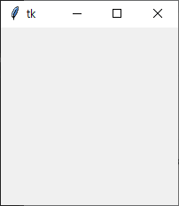
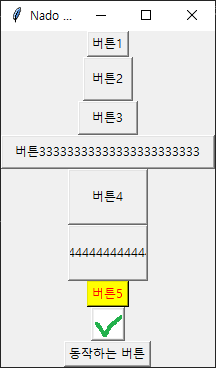
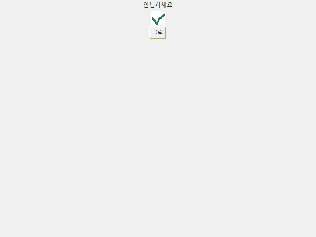
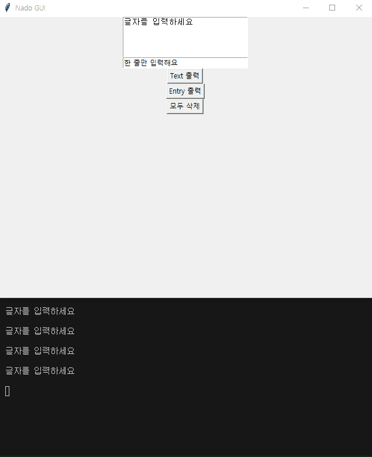
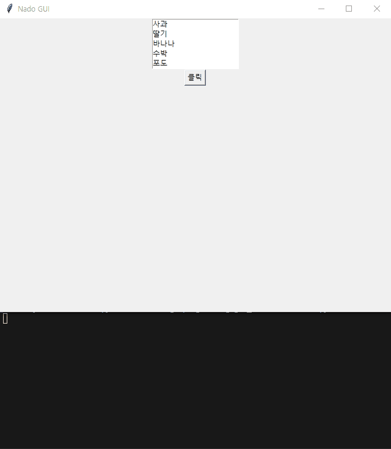
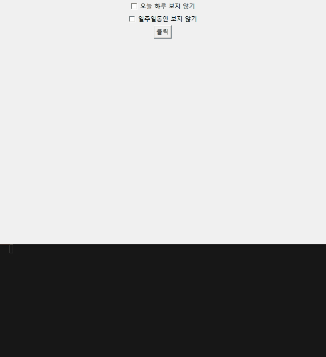
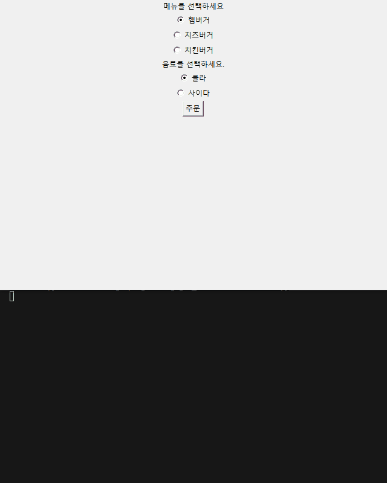
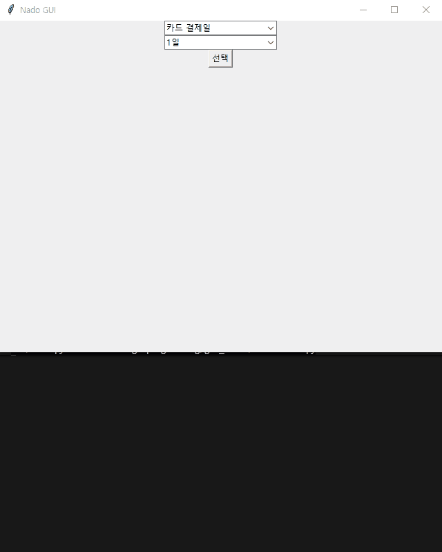

# [루트/README.md](../../README.md)

# 예제 1) 프레임

## 목차

1. 프로그램 초기화
2. 프로그램 창 타이틀  
3. 프로그램 창 크기 설정 및 위치 지정
4. 프로그램 loop 실행

<br>
<details>
<summary>접기/펼치기</summary>
<br>


Tkinter 라이브러리는 Python을 설치할 때 자동으로 모듈이 포함되기 때문에 따로 설치하거나 환경설정을 할 필요가 없다.  

## tkinter 최소 실행

```py
from tkinter import *

root = Tk()
root.mainloop()
```
1. from ~ import 구문을 활용하여 tkinter 패키지 전체 import.  
2. Tk 클래스 인스턴스 생성 및 할당
3. 프로그램 이벤트 루프 호출  

### 이벤트 루프 역할
- 프로그램 창이 종료되지 않도록 유지
- 마우스, 키보드 입력 감지
- 버튼 클릭, 창 닫기 등의 이벤트 감지 및 처리

## 프레임 레이아웃 기본 설정
- `title(string: str)` : 창 타이틀 지정
- `geometry(newGeometry: str)`: 창 크기설정  
  "{width}x{height}" 형태의 텍스트 문자열로 설정
- `resizable(width: bool,height: bool)`: 프로그램 창 크기 변경 비활성  
  bool 타입의 매개변수로 너비, 높이를 각각 비활성화

```py
from tkinter import *

root = Tk()
root.title("Nado GUI") # 프로그램 창 타이틀
root.geometry("640x480") # 프로그램 창 크기 설정 (가로x세로)
root.geometry("640x480+300+100") # 프로그램 창 크기 설정 및 위치 지정 (가로 * 세로 + X좌표 Y좌표)
root.resizable(False, False) # 프로그램 창 크기 변경 비활성 (너비, 높이)
root.mainloop()
```


</details>
<br>
<hr>
<br>

# 예제 2) 버튼 위젯

위젯이란 버튼이나 체크박스나 혹은 글자를 입력할 수 있는 텍스트상자 같은 것들을 말한다.  

## 목차
A) 버튼 인스턴스 생성.  
  1. 텍스트 타입 버튼 정의
  2. 버튼 크기 조정
      - 버튼 내부 좌우 여백(픽셀) : padx, pady
      - 너비/높이 : width, height
  3. 버튼 색상 조정
  4. 이미지 타입 버튼
  5. 버튼 동작 - 함수 정의 및 연동
B) 버튼 배치


<br>
<details>
<summary>접기/펼치기</summary>
<br>



## A/B) 기본 버튼 출력

버튼을 구성하기 위해서는 먼저 버튼 클래스를 통해 버튼 인스턴스를 생성하고, 해당 인스턴스로 부터 pack() 함수를 호출하여 최종적으로 버튼을 배치해야 출력된다.  
출력될 타입은 대표적으로 text 타입과 image 타입이 있다.  
먼저 아래와 같이 기본 텍스트 타입으로 버튼을 정의하고, 출력해보도록 한다.  
### 1. 텍스트 타입 버튼 정의
  ```py
  # 생략
  btn = Button(root, text="버튼")
  btn.pack()
  # 생략
  ```

### 2. 버튼 크기 조정
버튼 크기는 픽셀단위로 버튼 내부에서 좌우 여백을 지정하는 padx, pady 방식과,  
일반적인 너비, 높이를 지정하는 width, height 방식이 있다.  
- padx, pady: 버튼 내부 내용물 기준으로 버튼까지의 여백을 말하며, padx는 좌우여백, pady는 상하여백을 가리킨다.  
  ```py
  # 생략
  btn = Button(root, padx=5, pady=10, text="버튼")
  btn.pack()
  # 생략
  ```
  여백의 크기이므로, 버튼 내용물의 크기가 커질수록 버튼 크기는 동적으로 변경된다.  
- width, height
  ```py
  # 생략
  btn = Button(root, width=10, height=3, text="버튼")
  btn.pack()
  # 생략
  ```
  padx,pady와는 다르게 width, hegiht는 고정 크기이므로, 버튼 내용물이 커지면, 내용물이 잘려서 출력된다.  
  ```py
  btn = Button(root, width=10, height=3, text="버튼44444444444444444444444")
  btn.pack()
  ```

### 3. 버튼 색상 조정
버튼 색상의 fg는 foreground의 약자로, 글자색을. bg는 background의 약자로 배경색을 의미한다.
Button 인스턴스 생성시 매개변수로 전달하며 영문 텍스트로 색상을 정의한다.
```py
# 생략
btn = Button(root, fg="red", bg="yellow", text="버튼5")
btn.pack()
# 생략
```

### 4. 이미지 타입 버튼
PhotoImnage 클래스의 file 키워드에 이미지 경로를 전달하여 PhotoImange 인스턴스를 생성한 후,   
Button 클래스의 image 키워드에 해당 인스턴스를 전달하여 Button 인스턴스를 생성한다.  
```py
# 생략
photo = PhotoImage(file="gui_basic/img/check.png")
btn = Button(root, image=photo)
btn.pack()
# 생략
```

### 5. 버튼 동작 - 함수 정의 및 연동
일반적인 함수를 정의한 후, Button 클래스의 command 키워드에 해당 함수를 전달하여 Button 인스턴스를 생성한다.  
```py
# 생략
def btncmd():
  print("버튼이 클릭되었어요")
btn = Button(root, text="동작하는 버튼", command=btncmd)
btn.pack()
# 생략
```

</details>
<br>
<hr>
<br>

# 예제 3) 레이블 위젯
## 목차

A) 레이블 인스턴스 생성.  
  1. 텍스트 타입 레이블  
  2. 이미지 타입 레이블  
  3. 레이블 동적 업데이트 - 버튼 클릭시 레이블  
B) 레이블 배치

<br>
<details>
<summary>접기/펼치기</summary>
<br>



글자 혹은 이미지를 출력해주는 역할을 하며, 실제로 어떤 동작을 넣지는 못한다.  

## A/B) 기본 레이블 출력

버튼 구성과 동일하게 레이블 클래스를 통해 레이블 인스턴스를 생성하고, 해당 인스턴스로 부터 pack() 함수를 호출하여 최종적으로 레이블을 배치해야 출력된다.  
출력될 타입은 대표적으로 text 타입과 image 타입이 있다.  
1. 텍스트 타입 레이블
  ```py
  label1 = Label(root, text="안녕하세요")
  label1.pack()
  ```
2. 이미지 타입 레이블  
  ```py
  photo = PhotoImage(file="gui_basic/img/check.png")
  label2 = Label(root, image=photo)
  label2.pack()
  ```
3. 레이블 동적 업데이트
  이미 생성된 레이블은 프로그램 실행중 config 함수를 통해 동적으로 텍스트 혹은 이미지를 변경할 수 있다.  
  ```py
  # 레이블 동적 업데이트 : 버튼 클릭시 텍스트 변경
  def change():
    label1.config(text="또 만나요")
    global photo2
    photo2 = PhotoImage(file="gui_basic/img/x.png")
    label2.config(image=photo2)
  btn = Button(root, text="클릭", command=change)
  btn.pack()
  ```
  이때 유의할 점은 내부에서 생성한 이미지 변수는 global 변수로 선언해야한다.  
  파이썬 함수 안에서 대입한 변수는 기본적으로 지역 변수다.  
  지역 변수는 함수가 끝나면 이름이 사라진다.  
  PhotoImage는 참조가 유지되지 않으면 이미지가 사라질 수 있다.  
  그래서 global 또는 label2.image 같은 방식으로 참조를 유지해야 한다.

</details>
<br>
<hr>
<br>

# 예제 4) 텍스트, 엔트리 위젯
## 목차

A) 텍스트, 엔트리 인스턴스 생성.  
  1. Text 위젯  
  2. Entry 위젯  
  3. 기본값 입력  
  4. 입력값 출력  
  5. 입력값 삭제  
B) 텍스트, 엔트리 배치


<br>
<details>
<summary>접기/펼치기</summary>
<br>



Text 위젯과 Entry 위젯은 사용자로부터 글자를 입력받기 위해 사용한다.  
Text 위젯은 여러 줄 입력이 가능하고, Entry 위젯은 한 줄 입력만 가능하다.  

## A/B) 기본 텍스트, 엔트리 출력

버튼, 레이블 구성과 동일하게 Text, Entry 클래스를 통해 각각 인스턴스를 생성하고, 해당 인스턴스로 부터 pack() 함수를 호출하여 최종적으로 위젯을 배치해야 출력된다.  
1. Text 위젯
  ```py
  txt = Text(root, width=30, height=5)
  txt.pack()
  ```
  Text 위젯은 여러 줄의 글자를 입력받을 수 있다.  
  width는 너비, height는 높이를 의미한다.  
2. Entry 위젯
  ```py
  e = Entry(root, width=30)
  e.pack()
  ```
  Entry 위젯은 한 줄의 글자를 입력받을 수 있다.  
  비밀번호, 아이디, 검색어처럼 한 줄 입력이 필요한 경우 사용할 수 있다.  
3. 기본값 입력
  insert 함수를 통해 Text, Entry 위젯에 기본값을 입력할 수 있다.  
  ```py
  txt.insert(END, "글자를 입력하세요")
  e.insert(0, "한 줄만 입력해요")
  ```
  Text 위젯에서 END는 텍스트의 마지막 위치를 의미한다.  
  Entry 위젯에서 0은 글자가 입력될 인덱스 위치를 의미한다.  
4. 입력값 출력
  get 함수를 통해 Text, Entry 위젯에 입력된 값을 가져올 수 있다.  
  ```py
  ## Text 읽기
  btn1 = Button(root, text="Text 출력", command=lambda: print(txt.get("1.0", END)))
  btn1.pack()

  ## Entry 읽기
  btn2 = Button(root, text="Entry 출력", command=lambda: print(e.get()))
  btn2.pack()
  ```
  Text 위젯의 get 함수는 시작 위치와 끝 위치를 전달해야 한다.  
  "1.0"은 1번째 줄의 0번째 글자 위치를 의미하고, END는 마지막 위치를 의미한다.  
  Entry 위젯은 한 줄 입력이므로 get 함수에 별도의 위치를 전달하지 않아도 된다.  
5. 입력값 삭제
  delete 함수를 통해 Text, Entry 위젯에 입력된 값을 삭제할 수 있다.  
  ```py
  def btncmd(): 
    txt.delete("1.0", END)
    e.delete(0, END)

  btn3 = Button(root, text="모두 삭제", command=btncmd)
  btn3.pack()
  ```
  Text 위젯은 삭제할 시작 위치와 끝 위치를 전달해야 한다.  
  Entry 위젯도 삭제할 시작 인덱스와 끝 위치를 전달한다.  
  여기서는 각각 처음부터 끝까지 삭제하기 위해 "1.0", 0, END를 사용한다.

</details>
<br>
<hr>
<br>

# 예제 5) 리스트박스 위젯
## 목차

A) 리스트박스 인스턴스 생성.  
  1. Listbox 위젯  
  2. 항목 추가  
  3. 항목 삭제  
  4. 항목 개수 확인  
  5. 항목 조회  
  6. 선택된 항목 확인  
B) 리스트박스 배치


<br>
<details>
<summary>접기/펼치기</summary>
<br>



Listbox 위젯은 여러 가지 값을 목록 형태로 관리하고, 사용자가 목록 중 하나 또는 여러 개를 선택할 수 있게 해준다.  

## A/B) 기본 리스트박스 출력

버튼, 레이블 구성과 동일하게 Listbox 클래스를 통해 리스트박스 인스턴스를 생성하고, 해당 인스턴스로 부터 pack() 함수를 호출하여 최종적으로 위젯을 배치해야 출력된다.  
1. Listbox 위젯
  ```py
  listbox = Listbox(root, selectmode="extended", height=0)
  listbox.pack()
  ```
  selectmode는 목록 선택 방식을 의미한다.  
  "extended"는 여러 개 선택이 가능하고, "single"은 하나만 선택할 수 있다.  
  height는 목록의 높이를 의미한다.  
  height가 0이면 등록된 모든 목록을 출력한다.  
2. 항목 추가
  insert 함수를 통해 리스트박스에 항목을 추가할 수 있다.  
  ```py
  listbox.insert(0, "사과")
  listbox.insert(1, "딸기")
  listbox.insert(2, "바나나")
  listbox.insert(END, "수박")
  listbox.insert(END, "포도")
  ```
  첫 번째 매개변수는 항목이 들어갈 위치를 의미하고, 두 번째 매개변수는 추가할 값을 의미한다.  
  END를 사용하면 가장 마지막 위치에 항목을 추가한다.  
3. 항목 삭제
  delete 함수를 통해 리스트박스의 항목을 삭제할 수 있다.  
  ```py
  listbox.delete(END)
  listbox.delete(0)
  ```
  END는 가장 마지막 항목을 의미한다.  
  0은 가장 첫 번째 항목을 의미한다.  
4. 항목 개수 확인
  size 함수를 통해 리스트박스에 들어있는 항목의 개수를 확인할 수 있다.  
  ```py
  print("리스트에는 ", listbox.size(), "개가 있어요.")
  ```
5. 항목 조회
  get 함수를 통해 리스트박스의 항목을 가져올 수 있다.  
  ```py
  print("1번째부터 3번째까지의 항목 : ", listbox.get(0, 2))
  ```
  get 함수에 시작 위치와 끝 위치를 전달하면 해당 범위의 항목을 가져올 수 있다.  
  여기서 0은 첫 번째 항목, 2는 세 번째 항목을 의미한다.  
6. 선택된 항목 확인
  curselection 함수를 통해 현재 선택된 항목의 위치를 확인할 수 있다.  
  ```py
  print("선택된 항목 : ", listbox.curselection())
  ```
  curselection 함수는 선택된 항목의 값을 직접 가져오는 것이 아니라, 선택된 항목의 인덱스를 반환한다.  
  선택된 값을 가져오고 싶다면 반환된 인덱스를 get 함수에 전달하면 된다.  
  ```py
  for index in listbox.curselection():
    print(listbox.get(index))
  ```

## 버튼 클릭으로 리스트박스 조작

버튼의 command 키워드에 함수를 연결하면 버튼 클릭으로 리스트박스를 조작할 수 있다.  
```py
def btncmd():
  listbox.delete(END)
  listbox.delete(0)

  print("리스트에는 ", listbox.size(), "개가 있어요.")
  print("1번째부터 3번째까지의 항목 : ", listbox.get(0, 2))
  print("선택된 항목 : ", listbox.curselection())

btn = Button(root, text="클릭", command=btncmd)
btn.pack()
```

</details>
<br>
<hr>
<br>

# 예제 6) 체크버튼 위젯
## 목차

A) 체크버튼 인스턴스 생성.  
  1. IntVar 생성  
  2. Checkbutton 위젯  
  3. 체크 상태 설정  
  4. 체크 여부 확인  
B) 체크버튼 배치


<br>
<details>
<summary>접기/펼치기</summary>
<br>



Checkbutton 위젯은 사용자가 항목을 체크하거나 체크 해제할 수 있게 해준다.  
약관 동의, 옵션 선택, 다시 보지 않기 같은 값을 처리할 때 사용할 수 있다.  

## A/B) 기본 체크버튼 출력

버튼, 레이블 구성과 동일하게 Checkbutton 클래스를 통해 체크버튼 인스턴스를 생성하고, 해당 인스턴스로 부터 pack() 함수를 호출하여 최종적으로 위젯을 배치해야 출력된다.  
체크 여부는 IntVar 같은 변수 객체를 연결해서 확인할 수 있다.  
1. IntVar 생성
  ```py
  chkvar = IntVar()
  ```
  IntVar는 정수 값을 관리하는 Tkinter 변수이다.  
  체크버튼과 연결하면 체크 여부를 0 또는 1로 확인할 수 있다.  
  0은 체크 해제, 1은 체크 상태를 의미한다.  
2. Checkbutton 위젯
  ```py
  checkbox = Checkbutton(root, text="오늘 하루 보지 않기", variable=chkvar)
  checkbox.pack()
  ```
  text는 체크버튼에 출력될 글자를 의미한다.  
  variable에는 체크 여부를 저장할 Tkinter 변수를 전달한다.  
3. 체크 상태 설정
  select 함수와 deselect 함수를 통해 체크 상태를 직접 설정할 수 있다.  
  ```py
  checkbox.select()
  checkbox.deselect()
  ```
  select 함수는 체크 상태로 만들고, deselect 함수는 체크 해제 상태로 만든다.  
4. 체크 여부 확인
  get 함수를 통해 현재 체크 여부를 확인할 수 있다.  
  ```py
  def btncmd():
    print(chkvar.get())
  ```
  chkvar.get()의 결과가 0이면 체크 해제, 1이면 체크 상태이다.  

## 여러 체크버튼 사용

체크버튼을 여러 개 사용할 경우 각각의 체크버튼마다 별도의 Tkinter 변수를 연결한다.  
```py
chkvar = IntVar()
checkbox = Checkbutton(root, text="오늘 하루 보지 않기", variable=chkvar)
checkbox.pack()

chkvar2 = IntVar()
checkbox2 = Checkbutton(root, text="일주일동안 보지 않기", variable=chkvar2)
checkbox2.pack()
```
각 체크버튼은 서로 독립적으로 체크 상태를 가진다.  

## 버튼 클릭으로 체크 여부 확인

버튼의 command 키워드에 함수를 연결하면 버튼 클릭시 체크 여부를 확인할 수 있다.  
```py
def btncmd():
  print(chkvar.get())
  print(chkvar2.get())

btn = Button(root, text="클릭", command=btncmd)
btn.pack()
```

</details>
<br>
<hr>
<br>
# 예제 7) 라디오버튼 위젯
## 목차

A) 라디오버튼 인스턴스 생성.  
  1. IntVar 생성  
  2. Radiobutton 위젯  
  3. 기본 선택 설정  
  4. StringVar 사용  
  5. 선택된 값 확인  
B) 라디오버튼 배치


<br>
<details>
<summary>접기/펼치기</summary>
<br>



Radiobutton 위젯은 여러 항목 중 하나만 선택할 수 있게 해준다.  
체크버튼은 여러 개를 동시에 선택할 수 있지만, 라디오버튼은 같은 변수로 묶인 항목 중 하나만 선택된다.  

## A/B) 기본 라디오버튼 출력

버튼, 체크버튼 구성과 동일하게 Radiobutton 클래스를 통해 라디오버튼 인스턴스를 생성하고, 해당 인스턴스로 부터 pack() 함수를 호출하여 최종적으로 위젯을 배치해야 출력된다.  
라디오버튼은 같은 Tkinter 변수를 공유하는 항목끼리 하나의 그룹으로 묶인다.  
1. IntVar 생성
  ```py
  burger_var = IntVar()
  ```
  IntVar는 정수 값을 관리하는 Tkinter 변수이다.  
  라디오버튼과 연결하면 선택된 항목의 value 값을 정수로 확인할 수 있다.  
2. Radiobutton 위젯
  ```py
  btn_burger1 = Radiobutton(root, text="햄버거", value=1, variable=burger_var)
  btn_burger2 = Radiobutton(root, text="치즈버거", value=2, variable=burger_var)
  btn_burger3 = Radiobutton(root, text="치킨버거", value=3, variable=burger_var)

  btn_burger1.pack()
  btn_burger2.pack()
  btn_burger3.pack()
  ```
  text는 라디오버튼에 출력될 글자를 의미한다.  
  value는 해당 항목이 선택되었을 때 변수에 저장될 값을 의미한다.  
  variable에는 선택값을 저장할 Tkinter 변수를 전달한다.  
  같은 variable을 사용하는 라디오버튼끼리는 하나의 그룹이 된다.  
3. 기본 선택 설정
  select 함수를 통해 기본으로 선택될 라디오버튼을 지정할 수 있다.  
  ```py
  btn_burger1.select()
  ```
  위 코드는 햄버거 항목을 기본 선택 상태로 만든다.  
4. StringVar 사용
  라디오버튼의 value를 문자열로 관리하고 싶다면 StringVar를 사용할 수 있다.  
  ```py
  drink_var = StringVar()
  btn_drink1 = Radiobutton(root, text="콜라", value="콜라", variable=drink_var)
  btn_drink1.select()
  btn_drink2 = Radiobutton(root, text="사이다", value="사이다", variable=drink_var)

  btn_drink1.pack()
  btn_drink2.pack()
  ```
  StringVar는 문자열 값을 관리하는 Tkinter 변수이다.  
  선택된 라디오버튼의 value 값이 문자열로 저장된다.  
5. 선택된 값 확인
  get 함수를 통해 현재 선택된 라디오버튼의 value 값을 확인할 수 있다.  
  ```py
  def btncmd():
    print(burger_var.get())
    print(drink_var.get())

  btn = Button(root, text="주문", command=btncmd)
  btn.pack()
  ```
  burger_var.get()은 선택된 버거 항목의 정수 value를 반환한다.  
  drink_var.get()은 선택된 음료 항목의 문자열 value를 반환한다.  

## 라벨로 항목 구분

Label 위젯을 함께 사용하면 라디오버튼 그룹의 용도를 구분해서 보여줄 수 있다.  
```py
Label(root, text="메뉴를 선택하세요").pack()

burger_var = IntVar()
btn_burger1 = Radiobutton(root, text="햄버거", value=1, variable=burger_var)
btn_burger1.select()
btn_burger2 = Radiobutton(root, text="치즈버거", value=2, variable=burger_var)
btn_burger3 = Radiobutton(root, text="치킨버거", value=3, variable=burger_var)
btn_burger1.pack()
btn_burger2.pack()
btn_burger3.pack()

Label(root, text="음료를 선택하세요.").pack()

drink_var = StringVar()
btn_drink1 = Radiobutton(root, text="콜라", value="콜라", variable=drink_var)
btn_drink1.select()
btn_drink2 = Radiobutton(root, text="사이다", value="사이다", variable=drink_var)
btn_drink1.pack()
btn_drink2.pack()
```

</details>
<br>
<hr>
<br>

# 예제 8) 콤보박스 위젯
## 목차

A) 콤보박스 인스턴스 생성.  
  1. ttk 모듈 import  
  2. 선택 목록 생성  
  3. Combobox 위젯  
  4. 기본 문구 설정  
  5. 읽기 전용 콤보박스  
  6. 선택된 값 확인  
B) 콤보박스 배치


<br>
<details>
<summary>접기/펼치기</summary>
<br>



Combobox 위젯은 여러 값 중 하나를 선택할 수 있는 드롭다운 형태의 위젯이다.  
Entry처럼 직접 값을 입력할 수도 있고, readonly 상태로 만들면 정해진 목록에서만 선택할 수 있다.  

## A/B) 기본 콤보박스 출력

Combobox는 tkinter 기본 위젯이 아니라 ttk 모듈에 포함되어 있다.  
따라서 Combobox를 사용하려면 tkinter.ttk 모듈을 import 해야 한다.  
1. ttk 모듈 import
  ```py
  import tkinter.ttk as ttk
  from tkinter import *
  ```
  ttk는 Tkinter의 확장 위젯 모듈이다.  
  Combobox처럼 기본 tkinter보다 조금 더 다양한 형태의 위젯을 제공한다.  
2. 선택 목록 생성
  ```py
  values = [str(i) + "일" for i in range(1, 32)]
  ```
  리스트 컴프리헨션을 사용하여 1일부터 31일까지의 값을 만든다.  
  만들어진 values 리스트는 콤보박스의 선택 목록으로 사용된다.  
3. Combobox 위젯
  ```py
  combobox = ttk.Combobox(root, height=5, values=values)
  combobox.pack()
  ```
  height는 드롭다운 목록을 펼쳤을 때 한 번에 보여줄 항목 개수를 의미한다.  
  values에는 선택 목록으로 사용할 리스트를 전달한다.  
4. 기본 문구 설정
  set 함수를 사용하면 콤보박스에 처음 보여줄 값을 설정할 수 있다.  
  ```py
  combobox.set("카드 결제일")
  ```
  set으로 설정한 값은 목록에 없는 값이어도 표시할 수 있다.  
  일반 Combobox는 사용자가 직접 값을 입력할 수도 있다.  
5. 읽기 전용 콤보박스
  state를 "readonly"로 설정하면 사용자가 직접 입력하지 못하고 목록에서만 선택할 수 있다.  
  ```py
  readonly_combobox = ttk.Combobox(root, height=10, values=values, state="readonly")
  readonly_combobox.current(0)
  readonly_combobox.pack()
  ```
  current 함수는 인덱스를 기준으로 기본 선택값을 지정한다.  
  current(0)은 values 목록의 첫 번째 값을 기본으로 선택한다.  
6. 선택된 값 확인
  get 함수를 통해 현재 콤보박스에 선택된 값을 가져올 수 있다.  
  ```py
  def btncmd():
    print(combobox.get())
    print(readonly_combobox.get())

  btn = Button(root, text="선택", command=btncmd)
  btn.pack()
  ```
  일반 Combobox는 사용자가 직접 입력한 값도 get 함수로 가져올 수 있다.  
  readonly Combobox는 목록에서 선택된 값만 가져온다.  

</details>
<br>
<hr>
<br>

# 예제 ) 
## 목차


<br>
<details>
<summary>접기/펼치기</summary>
<br>


</details>
<br>
<hr>
<br>
