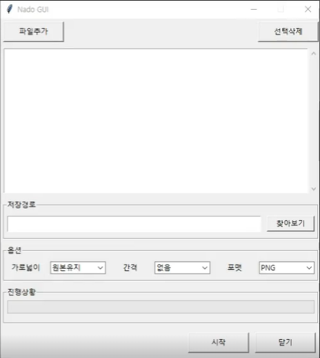
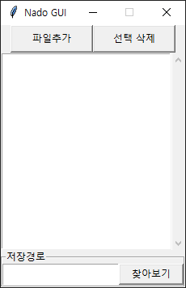
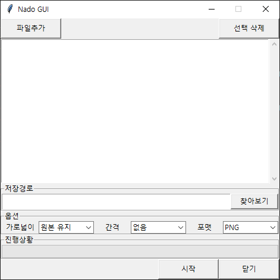
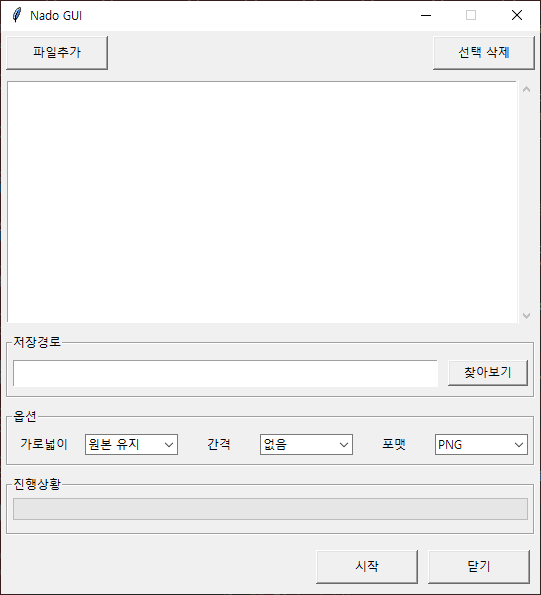
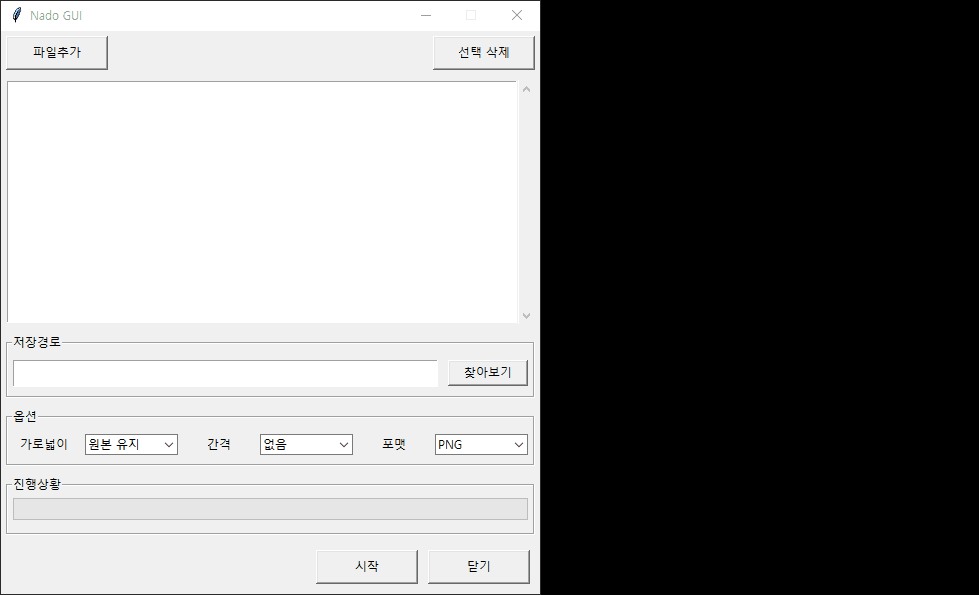
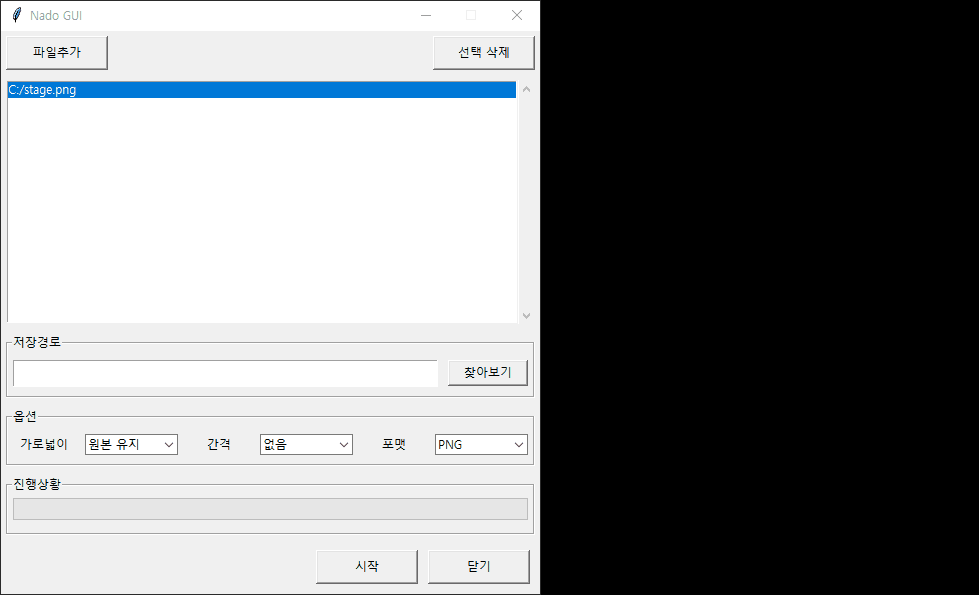

# [루트/README.md](../../README.md)
# [기본기](../../gui_basic/docs/README.md)

# 이미지 병합 GUI 프로그램

## [사용자 시나리오]
1. 사용자는 합치려는 이미지를 1개 이상 선택한다.  
2. 합쳐진 이미지가 저장될 경로를 지정한다.  
3. 가로넓이, 간격, 포맷 옵션을 지정한다.  
4. 시작 버튼을 통해 이미지를 합친다.  
5. 닫기 버튼을 통해 프로그램을 종료한다.  

## [기능 명세]
1. 파일추가 : 리스트 박스에 파일 추가
2. 선택삭제 : 리스트 박스에서 선택된 항목 삭제
3. 찾아보기 : 저장 폴더를 선택하면 텍스트 위젯에 입력
4. 가로넓이 : 이미지 넓이 지정 (원본유지, 1024, 800, 640)
5. 간격 : 이미지 간의 간격 지정 (없음, 좁게, 보통, 넓게)
6. 포맷 : 저장 이미지 포맷 지정 (PNG, JPG, BMP)
7. 시작 : 이미지 합치기 작업 실행
8. 진행상황 : 현재 진행중인 파일 순서에 맞게 반영
9. 닫기 : 프로그램 종료




# 예제 1) 레이아웃 1 - 파일 목록과 저장 경로 영역
## 목차

1. 프로그램 기본 창 생성
2. 파일 프레임
3. 리스트 프레임
4. 스크롤바와 리스트박스 연결
5. 저장 경로 프레임
6. 창 크기 변경 비활성화

<br>
<details>
<summary>접기/펼치기</summary>
<br>



이미지 병합 프로그램의 첫 번째 레이아웃에서는 파일 추가/삭제 버튼, 파일 목록 리스트박스, 저장 경로 입력 영역을 구성한다.  
여러 위젯을 기능별로 나누기 위해 `Frame`과 `LabelFrame`을 사용하고, 파일 목록처럼 스크롤이 필요한 영역은 `Scrollbar`와 `Listbox`를 서로 연결한다.  

## 1. 프로그램 기본 창 생성

- [1.create_layout.py](../1.create_layout.py)
  ```py
  from tkinter import *
  
  root = Tk()
  root.title("Nado GUI")
  ```

`Tk()`로 프로그램 창을 만들고, `title()`로 창 제목을 지정한다.  
이후 생성하는 모든 위젯은 `root` 또는 `root` 안에 배치된 프레임을 부모로 가진다.  

## 2. 파일 프레임

- [1.create_layout.py](../1.create_layout.py)
  ```py
  # 파일 프레임 (파일 추가, 선택 삭제)
  file_frame = Frame(root)
  file_frame.pack()
  
  btn_add_file = Button(file_frame, padx=5, pady=5, width=12, text="파일추가")
  btn_add_file.pack(side="left")
  
  btn_del_file = Button(file_frame, padx=5, pady=5, width=12, text="선택 삭제")
  btn_del_file.pack(side="right")
  ```

`file_frame`은 파일 관련 버튼을 묶는 영역이다.  
버튼의 부모를 `root`가 아니라 `file_frame`으로 지정했기 때문에 두 버튼은 `file_frame` 안에 배치된다.  

- `padx`, `pady`: 버튼 내부의 좌우/상하 여백
- `width`: 버튼 너비
- `side="left"`: 위젯을 왼쪽에 배치
- `side="right"`: 위젯을 오른쪽에 배치

`Button`을 생성할 때의 `padx`, `pady`는 버튼 내부 여백이다.  
즉, 버튼 글자와 버튼 테두리 사이의 공간을 늘린다.  

## 3. 리스트 프레임

- [1.create_layout.py](../1.create_layout.py)
  ```py
  # 리스트 프레임
  list_frame = Frame(root)
  list_frame.pack(fill="both")
  ```

`list_frame`은 파일 목록을 보여줄 `Listbox`와 세로 스크롤바를 함께 담는 영역이다.  
스크롤바와 리스트박스를 같은 프레임 안에 넣으면 두 위젯을 나란히 배치하기 쉽다.  

`fill="both"`는 위젯이 할당받은 공간의 가로와 세로를 모두 채우도록 한다.  
`fill="x"`는 가로, `fill="y"`는 세로, `fill="both"`는 가로와 세로 방향을 의미한다.  

## 4. 스크롤바와 리스트박스 연결

- [1.create_layout.py](../1.create_layout.py)
  ```py
  scrollbar = Scrollbar(list_frame)
  scrollbar.pack(side="right", fill="y")
  
  list_file = Listbox(
      list_frame,
      selectmode="extended",
      height=15,
      yscrollcommand=scrollbar.set
  )
  list_file.pack(side="left", fill="both", expand=True)
  
  scrollbar.config(command=list_file.yview)
  ```

`Scrollbar`는 단독으로 사용하는 위젯이 아니라, 스크롤할 대상 위젯과 서로 연결해서 사용한다.  
여기서는 `Listbox`와 `Scrollbar`를 연결한다.  

### Scrollbar 배치

- [1.create_layout.py](../1.create_layout.py)
  ```py
  scrollbar.pack(side="right", fill="y")
  ```

스크롤바를 `list_frame`의 오른쪽에 배치하고, 할당받은 공간의 세로를 모두 채우도록 한다.  
`fill="y"`는 세로 방향으로 늘어나게 하는 옵션이다.  

### Listbox 생성

- [1.create_layout.py](../1.create_layout.py)
  ```py
  list_file = Listbox(
      list_frame,
      selectmode="extended",
      height=15,
      yscrollcommand=scrollbar.set
  )
  ```

- `selectmode="extended"`: 여러 항목을 동시에 선택할 수 있게 한다.  
- `height=15`: 리스트박스에 표시할 높이를 지정한다.  
- `yscrollcommand=scrollbar.set`: 리스트박스의 세로 스크롤 위치를 스크롤바에 전달한다.  

### Listbox 배치

- [1.create_layout.py](../1.create_layout.py)
  ```py
  list_file.pack(side="left", fill="both", expand=True)
  ```

리스트박스를 `list_frame`의 왼쪽에 배치하고, 가로와 세로 방향으로 영역을 채우도록 한다.  

- `fill="both"`: 할당받은 공간의 가로와 세로를 모두 채움
- `expand=True`: 부모 위젯에 남는 공간이 있으면 해당 위젯이 공간을 더 배정받음

`expand=True`는 남는 공간을 배정받게 하는 옵션이고, `fill`은 배정받은 공간 안에서 어느 방향으로 채울지 정하는 옵션이다.  

### 스크롤 동작 연결

- [1.create_layout.py](../1.create_layout.py)
  ```py
  scrollbar.config(command=list_file.yview)
  ```

스크롤바를 움직였을 때 리스트박스의 세로 화면이 함께 움직이도록 연결한다.  
리스트박스와 스크롤바는 아래처럼 양쪽 연결이 필요하다.  

- `yscrollcommand=scrollbar.set`: 리스트박스의 움직임을 스크롤바에 알려줌
- `command=list_file.yview`: 스크롤바의 움직임을 리스트박스에 알려줌

## 5. 저장 경로 프레임

- [1.create_layout.py](../1.create_layout.py)
  ```py
  # 저장 경로 프레임
  path_frame = LabelFrame(root, text="저장경로")
  path_frame.pack()
  
  txt_dest_path = Entry(path_frame)
  txt_dest_path.pack(side="left", fill="x", expand=True, ipady=4)
  
  btn_dest_path = Button(path_frame, text="찾아보기", width=10)
  btn_dest_path.pack(side="right")
  ```

`LabelFrame`은 제목이 있는 프레임이다.  
여기서는 `text="저장경로"`를 전달하여 저장 경로 입력 영역이라는 제목을 보여준다.  

### Entry 위젯

- [1.create_layout.py](../1.create_layout.py)
  ```py
  txt_dest_path = Entry(path_frame)
  txt_dest_path.pack(side="left", fill="x", expand=True, ipady=4)
  ```

`Entry`는 한 줄짜리 입력 위젯이다.  
저장 폴더를 선택하면 나중에 이 입력칸에 경로가 표시되도록 사용할 수 있다.  

- `side="left"`: 왼쪽에 배치
- `fill="x"`: 할당받은 공간의 가로를 모두 채움
- `expand=True`: 남는 가로 공간을 배정받음
- `ipady=4`: 위젯 내부의 세로 여백을 추가해서 높이를 키움

`ipady`의 `i`는 internal을 의미한다.  
따라서 `ipadx`, `ipady`는 위젯 내부 여백이고, `padx`, `pady`는 보통 위젯 바깥 여백으로 사용된다.  

### 찾아보기 버튼

- [1.create_layout.py](../1.create_layout.py)
  ```py
  btn_dest_path = Button(path_frame, text="찾아보기", width=10)
  btn_dest_path.pack(side="right")
  ```

`찾아보기` 버튼은 저장 폴더를 선택하는 기능과 연결될 버튼이다.  
현재 예제에서는 레이아웃만 만들고, 실제 폴더 선택 기능은 이후 단계에서 추가한다.  

## 6. 창 크기 변경 비활성화

- [1.create_layout.py](../1.create_layout.py)
  ```py
  root.resizable(False, False)
  root.mainloop()
  ```

`resizable(False, False)`는 창의 가로, 세로 크기 변경을 비활성화한다.  
`mainloop()`는 프로그램 창이 바로 종료되지 않고 이벤트를 계속 받을 수 있도록 실행 루프를 시작한다.  

## 전체 코드

- [1.create_layout.py](../1.create_layout.py)
  ```py
  from tkinter import *
  
  root = Tk()
  root.title("Nado GUI")
  
  # 파일 프레임 (파일 추가, 선택 삭제)
  file_frame = Frame(root)
  file_frame.pack()
  
  btn_add_file = Button(file_frame, padx=5, pady=5, width=12, text="파일추가")
  btn_add_file.pack(side="left")
  
  btn_del_file = Button(file_frame, padx=5, pady=5, width=12, text="선택 삭제")
  btn_del_file.pack(side="right")
  
  # 리스트 프레임
  list_frame = Frame(root)
  list_frame.pack(fill="both")
  
  scrollbar = Scrollbar(list_frame)
  scrollbar.pack(side="right", fill="y")
  
  list_file = Listbox(list_frame, selectmode="extended", height=15, yscrollcommand=scrollbar.set)
  list_file.pack(side="left", fill="both", expand=True)
  
  scrollbar.config(command=list_file.yview)
  
  # 저장 경로 프레임
  path_frame = LabelFrame(root, text="저장경로")
  path_frame.pack()
  
  txt_dest_path = Entry(path_frame)
  txt_dest_path.pack(side="left", fill="x", expand=True, ipady=4)
  
  btn_dest_path = Button(path_frame, text="찾아보기", width=10)
  btn_dest_path.pack(side="right")
  
  root.resizable(False, False)
  root.mainloop()
  ```

</details>
<br>
<hr>
<br>

# 예제 2) 레이아웃 2 - 옵션, 진행상황, 실행 영역
## 목차

1. A) 옵션 프레임
2. B) 파일 프레임 가로 채우기
3. C) 저장 경로 프레임 가로 채우기
4. D) 진행상황 Progressbar
5. E) 실행 프레임
6. 변경 코드 흐름

<br>
<details>
<summary>접기/펼치기</summary>
<br>



첫 번째 레이아웃에서 파일 목록과 저장 경로 영역을 만든 뒤, 두 번째 레이아웃에서는 이미지 병합에 필요한 옵션 영역, 진행상황 표시 영역, 실행 버튼 영역을 추가한다.  
옵션 선택에는 `ttk.Combobox`를 사용하고, 진행률 표시는 `ttk.Progressbar`와 `DoubleVar`를 연결해서 구성한다.  

## 1. A) 옵션 프레임

- [1.create_layout.py](../1.create_layout.py)
  ```py
  import tkinter.ttk as ttk
  
  ### 생략
  
  ## A) 옵션 프레임
  frame_option = LabelFrame(root, text="옵션")
  frame_option.pack()
  ```

`ttk.Combobox`를 사용하기 위해 `tkinter.ttk` 모듈을 `ttk`라는 이름으로 가져온다.  
`frame_option`은 가로넓이, 간격, 포맷 옵션을 한 줄에 묶어서 배치하는 영역이다.  

`LabelFrame`은 일반 `Frame`처럼 위젯을 담을 수 있으면서, `text` 옵션으로 영역 제목을 표시할 수 있다.  

### 가로넓이 옵션

- [1.create_layout.py](../1.create_layout.py)
  ```py
  ## 1. 가로 넓이 옵션
  ### 1-1. 가로 넓이 라벨
  Label(frame_option, text="가로넓이", width=8).pack(side="left")
  
  ### 1-2. 가로 넓이 콤보
  opt_width=["원본 유지", "1024", "800", "640"]
  cmb_width = ttk.Combobox(frame_option, state="readonly", values=opt_width, width=10)
  cmb_width.current(0)
  cmb_width.pack(side="left")
  ```

`Label`은 옵션 이름을 보여주고, `Combobox`는 사용자가 선택할 수 있는 값을 목록으로 제공한다.  

- `state="readonly"`: 사용자가 직접 입력하지 못하고 목록에서만 선택하게 함
- `values=opt_width`: 콤보박스에 표시할 선택 목록
- `current(0)`: 첫 번째 항목을 기본값으로 선택
- `side="left"`: 옵션들을 왼쪽부터 차례대로 배치

### 간격 옵션

- [1.create_layout.py](../1.create_layout.py)
  ```py
  ## 2. 간격 옵션
  ### 2-1. 간격 옵션 라벨
  Label(frame_option, text="간격", width=8).pack(side="left")
  
  opt_space=["없음", "좁게", "보통", "넓게"]
  cmb_space = ttk.Combobox(frame_option, state="readonly", values=opt_space, width=10)
  cmb_space.current(0)
  cmb_space.pack(side="left")
  ### 2-2. 간격 옵션 라벨
  ```

간격 옵션도 같은 방식으로 구성한다.  
나중에 이미지 병합 기능을 구현할 때 선택된 값에 따라 이미지 사이 여백을 다르게 적용할 수 있다.  

### 파일 포맷 옵션

- [1.create_layout.py](../1.create_layout.py)
  ```py
  ## 3. 파일 포맷 옵션
  Label(frame_option, text="포맷", width=8).pack(side="left")
  
  opt_format=["PNG", "JPG", "BMP"]
  cmb_format = ttk.Combobox(frame_option, state="readonly", values=opt_format, width=10)
  cmb_format.current(0)
  cmb_format.pack(side="left")
  ```

포맷 옵션은 저장할 이미지 파일 형식을 선택하는 영역이다.  
`PNG`, `JPG`, `BMP` 중 하나를 선택하도록 콤보박스를 만든다.  

## 2. B) 파일 프레임 가로 채우기

- [1.create_layout.py](../1.create_layout.py)
  ```py
  ## B) 파일 프레임 가로 채우기
  ### 파일 프레임 (파일 추가, 선택 삭제)
  file_frame = Frame(root)
  file_frame.pack(fill="x") # B) x축 기준 간격 펼치기
  
  ### 생략
  ```

기존 파일 프레임에 `fill="x"`를 추가해서 가로 방향으로 부모 영역을 채우도록 한다.  
`width`로 고정 너비를 지정하는 대신, 창이나 부모 위젯이 가진 가로 공간에 맞게 자연스럽게 늘어나게 하는 방식이다.  

## 3. C) 저장 경로 프레임 가로 채우기

- [1.create_layout.py](../1.create_layout.py)
  ```py
  ## C) 저장 경로 프레임 가로 채우기
  ### 저장 경로 프레임
  path_frame = LabelFrame(root, text="저장경로")
  path_frame.pack(fill="x") # C) 저장경로 x축 기준 간격 펼치기
  
  txt_dest_path = Entry(path_frame, width=50)
  txt_dest_path.pack(side="left", fill="x", expand=True, ipady=4) # iapy: 높이 조정
  
  ### 생략
  ```

저장 경로 영역도 `fill="x"`로 가로 공간을 채운다.  
안쪽의 `Entry`에는 `fill="x"`와 `expand=True`를 함께 사용해서, 찾아보기 버튼을 제외한 남은 가로 공간을 입력칸이 차지하도록 한다.  

- `fill="x"`: 배정받은 공간의 가로 방향을 채움
- `expand=True`: 부모 위젯에 남는 공간이 있으면 해당 위젯이 더 배정받음
- `width=50`: 입력칸의 기본 요청 너비
- `ipady=4`: 입력칸 내부 세로 여백을 늘려 높이를 조정

## 4. D) 진행상황 Progressbar

- [1.create_layout.py](../1.create_layout.py)
  ```py
  ### 생략
  
  ## D) 진행상황 Progress Bar
  frame_progress = LabelFrame(root, text="진행상황")
  frame_progress.pack(fill="x")
  
  p_var = DoubleVar()
  progress_bar = ttk.Progressbar(frame_progress, maximum=100, variable=p_var)
  progress_bar.pack(fill="x")
  ```

`frame_progress`는 이미지 병합 진행률을 보여주는 영역이다.  
`Progressbar`는 `ttk`에서 제공하는 진행 표시 위젯이고, `variable` 옵션에 변수를 연결해서 진행률 값을 관리할 수 있다.  

- `DoubleVar()`: 실수 값을 저장할 수 있는 Tkinter 변수
- `maximum=100`: 진행률의 최대값을 100으로 지정
- `variable=p_var`: 진행률 값을 `p_var`와 연결
- `fill="x"`: 진행바가 가로 방향으로 영역을 채우도록 배치

나중에 이미지 병합 작업을 실행하면서 `p_var.set(값)`을 호출하면 진행바가 해당 값에 맞게 갱신된다.  

## 5. E) 실행 프레임

- [1.create_layout.py](../1.create_layout.py)
  ```py
  ### 생략
  
  ## E) 실행 프레임
  frame_run = Frame(root)
  frame_run.pack(fill="x")
  
  btn_close = Button(frame_run, padx=5, pady=5, text="닫기", width=12, command=root.quit)
  btn_close.pack(side="right")
  
  btn_start = Button(frame_run, padx=5, pady=5, text="시작", width=12)
  btn_start.pack(side="right")
  
  ### 생략
  ```

`frame_run`은 프로그램 실행과 종료 버튼을 담는 영역이다.  
두 버튼 모두 `side="right"`로 배치했기 때문에 오른쪽부터 차례대로 붙는다.  

`닫기` 버튼에는 `command=root.quit`을 연결해서 버튼을 누르면 Tkinter 이벤트 루프가 종료되도록 한다.  
`시작` 버튼은 이후 이미지 병합 기능을 구현할 때 실제 작업 함수와 연결할 수 있다.  

## 6. 변경 코드 흐름

- [1.create_layout.py](../1.create_layout.py)
  ```py
  from tkinter import *
  import tkinter.ttk as ttk
  
  root = Tk()
  root.title("Nado GUI")
  
  ## B) 파일 프레임 가로 채우기
  ### 파일 프레임 (파일 추가, 선택 삭제)
  file_frame = Frame(root)
  file_frame.pack(fill="x") # B) x축 기준 간격 펼치기
  
  ### 생략
  
  ## 리스트 프레임
  ### 생략
  
  ## C) 저장 경로 프레임 가로 채우기
  ### 저장 경로 프레임
  path_frame = LabelFrame(root, text="저장경로")
  path_frame.pack(fill="x") # C) 저장경로 x축 기준 간격 펼치기
  
  txt_dest_path = Entry(path_frame, width=50)
  txt_dest_path.pack(side="left", fill="x", expand=True, ipady=4) # iapy: 높이 조정
  
  ### 생략
  
  ## A) 옵션 프레임
  frame_option = LabelFrame(root, text="옵션")
  frame_option.pack()
  
  ## 1. 가로 넓이 옵션
  ### 1-1. 가로 넓이 라벨
  Label(frame_option, text="가로넓이", width=8).pack(side="left")
  ### 1-2. 가로 넓이 콤보
  opt_width=["원본 유지", "1024", "800", "640"]
  cmb_width = ttk.Combobox(frame_option, state="readonly", values=opt_width, width=10)
  cmb_width.current(0)
  cmb_width.pack(side="left")
  
  ## 2. 간격 옵션
  ### 2-1. 간격 옵션 라벨
  Label(frame_option, text="간격", width=8).pack(side="left")
  opt_space=["없음", "좁게", "보통", "넓게"]
  cmb_space = ttk.Combobox(frame_option, state="readonly", values=opt_space, width=10)
  cmb_space.current(0)
  cmb_space.pack(side="left")
  ### 2-2. 간격 옵션 라벨
  
  ## 3. 파일 포맷 옵션
  Label(frame_option, text="포맷", width=8).pack(side="left")
  opt_format=["PNG", "JPG", "BMP"]
  cmb_format = ttk.Combobox(frame_option, state="readonly", values=opt_format, width=10)
  cmb_format.current(0)
  cmb_format.pack(side="left")
  
  ## D) 진행상황 Progress Bar
  frame_progress = LabelFrame(root, text="진행상황")
  frame_progress.pack(fill="x")
  
  p_var = DoubleVar()
  progress_bar = ttk.Progressbar(frame_progress, maximum=100, variable=p_var)
  progress_bar.pack(fill="x")
  
  ## E) 실행 프레임
  frame_run = Frame(root)
  frame_run.pack(fill="x")
  
  btn_close = Button(frame_run, padx=5, pady=5, text="닫기", width=12, command=root.quit)
  btn_close.pack(side="right")
  
  btn_start = Button(frame_run, padx=5, pady=5, text="시작", width=12)
  btn_start.pack(side="right")
  
  root.resizable(False, False)
  root.mainloop()
  ```

</details>
<br>
<hr>
<br>

# 예제 3) 레이아웃 3 - 여백과 높이 조정
## 목차

1. A) 간격 띄우기 - `padx`, `pady`
   1. 파일/리스트 프레임
   2. 저장 경로 영역
   3. 옵션 영역
   4. 진행상황/실행 영역
2. B) 프레임 높이 조정 - `ipady`
   1. 높이를 조정한 프레임
3. 변경 코드 흐름

<br>
<details>
<summary>접기/펼치기</summary>
<br>



이번 단계에서는 각 영역에 `padx`, `pady`로 바깥 여백을 주고, 일부 프레임에는 `ipady`로 내부 높이를 조정한다.  
`padx`, `pady`는 위젯 바깥 간격이고, `ipady`는 위젯 내부의 세로 여백이다.  

## 1. A) 간격 띄우기 - `padx`, `pady`

`padx`, `pady`는 위젯 바깥 간격을 만든다.  
파일/리스트/저장경로/옵션/진행상황/실행 영역에 적용했다.  

### 1. 파일/리스트 프레임

파일 버튼 영역과 리스트 영역에 `padx=5`, `pady=5`를 추가해서 창 테두리와 위젯 사이에 간격을 만든다.  

- [1.create_layout.py](../1.create_layout.py)
  ```py
  ### 파일 프레임 (파일 추가, 선택 삭제)
  file_frame = Frame(root)
  file_frame.pack(fill="x", padx=5, pady=5)
  
  ### 생략
  
  ### 리스트 프레임
  list_frame=Frame(root)
  list_frame.pack(fill="both", padx=5, pady=5)
  ```

### 2. 저장 경로 영역

저장 경로 프레임 자체와 내부의 `Entry`, `Button`에 바깥 여백을 추가한다.  
`Entry`는 기존처럼 `fill="x"`, `expand=True`를 유지해서 남는 가로 공간을 채운다.  

- [1.create_layout.py](../1.create_layout.py)
  ```py
  ### 저장 경로 프레임
  path_frame = LabelFrame(root, text="저장경로")
  path_frame.pack(fill="x", padx=5, pady=5, ipady=4)
  
  txt_dest_path = Entry(path_frame, width=50)
  txt_dest_path.pack(side="left", fill="x", expand=True, padx=5, pady=5, ipady=4)
  
  btn_dest_path = Button(path_frame, text="찾아보기", width=10)
  btn_dest_path.pack(side="right", padx=5, pady=5)
  ```

### 3. 옵션 영역

옵션 프레임과 내부 라벨, 콤보박스에 `padx`, `pady`를 적용해서 옵션 위젯들이 서로 붙지 않게 한다.  

- [1.create_layout.py](../1.create_layout.py)
  ```py
  ### 옵션 프레임
  frame_option = LabelFrame(root, text="옵션")
  frame_option.pack(padx=5, pady=5, ipady=4)
  
  ### 가로 넓이 라벨
  Label(frame_option, text="가로넓이", width=8).pack(side="left", padx=5, pady=5)
  
  ### 생략
  
  cmb_width.pack(side="left", padx=5, pady=5)
  
  ### 생략
  
  Label(frame_option, text="포맷", width=8).pack(side="left", padx=5, pady=5)
  
  ### 생략
  
  cmb_format.pack(side="left", padx=5, pady=5)
  ```

### 4. 진행상황/실행 영역

진행상황 프레임, 진행바, 실행 프레임, 실행 버튼에 여백을 적용해서 하단 영역의 밀도를 낮춘다.  

- [1.create_layout.py](../1.create_layout.py)
  ```py
  ### 진행상황 Progress Bar
  frame_progress = LabelFrame(root, text="진행상황")
  frame_progress.pack(fill="x", padx=5, pady=5, ipady=4)
  
  ### 생략
  
  progress_bar.pack(fill="x", padx=5, pady=5)
  
  ### 실행 프레임
  frame_run = Frame(root)
  frame_run.pack(fill="x", padx=5, pady=5)
  
  ### 생략
  
  btn_close.pack(side="right", padx=5, pady=5)
  
  btn_start.pack(side="right", padx=5, pady=5)
  ```

## 2. B) 프레임 높이 조정 - `ipady`

`ipady`는 위젯 내부의 세로 여백을 만든다.  
저장 경로, 옵션, 진행상황 `LabelFrame`에 적용했다.  

### 1. 높이를 조정한 프레임

저장 경로, 옵션, 진행상황 `LabelFrame`에 `ipady=4`를 적용해서 프레임 내부의 세로 공간을 늘린다.  

- [1.create_layout.py](../1.create_layout.py)
  ```py
  ### 저장 경로 프레임
  path_frame = LabelFrame(root, text="저장경로")
  path_frame.pack(fill="x", padx=5, pady=5, ipady=4)
  
  ### 생략
  
  ### 옵션 프레임
  frame_option = LabelFrame(root, text="옵션")
  frame_option.pack(padx=5, pady=5, ipady=4)
  
  ### 생략
  
  ### 진행상황 Progress Bar
  frame_progress = LabelFrame(root, text="진행상황")
  frame_progress.pack(fill="x", padx=5, pady=5, ipady=4)
  ```

## 3. 변경 코드 흐름

- [1.create_layout.py](../1.create_layout.py)
  ```py
  from tkinter import *
  import tkinter.ttk as ttk
  
  root = Tk()
  root.title("Nado GUI")
  
  ## A) 파일 프레임 간격 띄우기
  ### 파일 프레임 (파일 추가, 선택 삭제)
  file_frame = Frame(root)
  file_frame.pack(fill="x", padx=5, pady=5) # x축 기준 간격 펼치기 / A) 간격 띄우기 - pad
  
  ### 생략
  
  ## A) 리스트 프레임 간격 띄우기
  ### 리스트 프레임
  list_frame=Frame(root)
  list_frame.pack(fill="both", padx=5, pady=5)
  
  ### 생략
  
  ## B) 저장 경로 프레임 높이 조정
  ### 저장 경로 프레임
  path_frame = LabelFrame(root, text="저장경로")
  path_frame.pack(fill="x", padx=5, pady=5, ipady=4) # 저장경로 x축 기준 간격 펼치기 / B) 프레임 높이 조정 - ipad
  
  ## A) 저장 경로 내부 위젯 간격 띄우기
  txt_dest_path = Entry(path_frame, width=50)
  txt_dest_path.pack(side="left", fill="x", expand=True, padx=5, pady=5, ipady=4) # iapy: 높이 조정 / A) 간격 띄우기 - pad
  
  btn_dest_path = Button(path_frame, text="찾아보기", width=10)
  btn_dest_path.pack(side="right", padx=5, pady=5)
  
  ### 생략
  
  ## B) 옵션 프레임 높이 조정
  ### 옵션 프레임
  frame_option = LabelFrame(root, text="옵션")
  frame_option.pack(padx=5, pady=5, ipady=4) # B) 프레임 높이 조정 - ipad
  
  ## A) 옵션 위젯 간격 띄우기
  ### 가로 넓이 라벨
  Label(frame_option, text="가로넓이", width=8).pack(side="left", padx=5, pady=5) # A) 간격 띄우기 - pad
  
  ### 생략
  
  cmb_width.pack(side="left", padx=5, pady=5) # A) 간격 띄우기 - pad
  
  ### 생략
  
  Label(frame_option, text="포맷", width=8).pack(side="left", padx=5, pady=5) # A) 간격 띄우기 - pad
  
  ### 생략
  
  cmb_format.pack(side="left", padx=5, pady=5) # A) 간격 띄우기 - pad
  
  ## B) 진행상황 프레임 높이 조정
  ### 진행상황 Progress Bar
  frame_progress = LabelFrame(root, text="진행상황")
  frame_progress.pack(fill="x", padx=5, pady=5, ipady=4) # B) 프레임 높이 조정 - ipad / B) 프레임 높이 조정 - ipad
  
  p_var = DoubleVar()
  progress_bar = ttk.Progressbar(frame_progress, maximum=100, variable=p_var)
  progress_bar.pack(fill="x", padx=5, pady=5) # A) 간격 띄우기 - pad
  
  ## A) 실행 프레임과 버튼 간격 띄우기
  ### 실행 프레임
  frame_run = Frame(root)
  frame_run.pack(fill="x", padx=5, pady=5)
  
  ### 생략
  
  btn_close.pack(side="right", padx=5, pady=5) # A) 간격 띄우기 - pad
  
  btn_start = Button(frame_run, padx=5, pady=5, text="시작", width=12)
  btn_start.pack(side="right", padx=5, pady=5) # A) 간격 띄우기 - pad
  
  root.resizable(False, False)
  root.mainloop()
  ```

</details>
<br>
<hr>
<br>

# 예제 4) 기본 기능 1 - 파일 추가와 선택 삭제
## 목차

1. A) 파일 추가
2. B) 선택 삭제
3. 변경 코드 흐름

<br>
<details>
<summary>접기/펼치기</summary>
<br>



파일 목록 영역에 실제 동작을 연결하는 단계이다.  
함수는 파일 프레임을 만든 뒤, 버튼을 생성하기 전에 정의한다.  

## 1. A) 파일 추가

`filedialog.askopenfilenames()`는 여러 파일을 한 번에 선택할 수 있는 파일 선택 창을 띄운다.  
`title`은 파일 선택 창 제목, `filetypes`는 선택 가능한 파일 형식, `initialdir`은 처음 열릴 기본 경로를 의미한다.  
선택된 파일 경로들은 `Listbox`의 마지막 위치에 순서대로 추가한다.  

- [2.basic_function.py](../2.basic_function.py)
  ```py
  # 생략
  from tkinter import filedialog
  # 생략

  # 생략(파일 프레임)
  def add_file():
    files = filedialog.askopenfilenames(title="이미지 파일을 선택하세요",
                                        filetypes=(("PNG 파일", "*.png"), ("모든 파일", "*.*")),
                                        initialdir="C:/"
    )

    for file in files:
      list_file.insert(END, file)

  # 생략(선택 삭제 함수)

  btn_add_file = Button(file_frame, padx=5, pady=5, width=12, text="파일추가", command=add_file)
  btn_add_file.pack(side="left")
  # 생략(선택 삭제 버튼 정의 및 출력)
  ```

## 2. B) 선택 삭제

`list_file.curselection()`은 현재 선택된 항목들의 인덱스를 반환한다.  
여러 항목을 앞에서부터 삭제하면 뒤 항목의 인덱스가 앞으로 당겨져 삭제 대상이 어긋날 수 있다.  
그래서 `reversed()`로 선택 인덱스를 뒤에서부터 순회한다.  
현재 코드에서는 삭제되는 인덱스를 `print(index)`로 확인하고, 이어서 `list_file.delete(index)`로 리스트박스에서 해당 항목을 제거한다.  

- [2.basic_function.py](../2.basic_function.py)
  ```py
  def add_file():
    # 생략(파일 추가)

  def del_file():
    for index in reversed(list_file.curselection()):
      print(index)
      list_file.delete(index)

  # 생략(파일 추가 버튼 배치)

  btn_add_file = Button(file_frame, padx=5, pady=5, width=12, text="파일추가", command=add_file)
  btn_add_file.pack(side="left")

  btn_del_file = Button(file_frame, padx=5, pady=5, width=12, text="선택 삭제", command=del_file)
  btn_del_file.pack(side="right")
  ```

## 3. 변경 코드 흐름
- [2.basic_function.py](../2.basic_function.py)
  ```py
  from tkinter import *
  from tkinter import filedialog
  import tkinter.ttk as ttk

  root = Tk()
  root.title("Nado GUI")

  # 생략(파일 프레임)

  file_frame = Frame(root)
  file_frame.pack(fill="x", padx=5, pady=5)

  # 생략(파일 추가/선택 삭제 버튼 기능 정의)

  def add_file():
    files = filedialog.askopenfilenames(title="이미지 파일을 선택하세요",
                                        filetypes=(("PNG 파일", "*.png"), ("모든 파일", "*.*")),
                                        initialdir="C:/"
    )

    for file in files:
      list_file.insert(END, file)

  def del_file():
    for index in reversed(list_file.curselection()):
      print(index)
      list_file.delete(index)

  btn_add_file = Button(file_frame, padx=5, pady=5, width=12, text="파일추가", command=add_file)
  btn_add_file.pack(side="left")

  btn_del_file = Button(file_frame, padx=5, pady=5, width=12, text="선택 삭제", command=del_file)
  btn_del_file.pack(side="right")

  # 생략(리스트 프레임 이하 레이아웃)

  root.resizable(False, False)
  root.mainloop()
  ```

</details>
<br>
<hr>
<br>

# 예제 5) 기본 기능 2 - 저장 경로와 시작 검증
## 목차

1. C) 저장 경로 선택
2. D) 시작 전 옵션/입력값 확인
3. 변경 코드 흐름


<br>
<details>
<summary>접기/펼치기</summary>
<br>



저장 경로 선택 버튼과 시작 버튼에 실제 동작을 연결하는 단계이다.  
저장 경로는 폴더 선택 창에서 받아와 `Entry`에 표시하고, 시작 버튼은 파일 목록과 저장 경로가 비어 있는지 먼저 확인한다.  

## 1. C) 저장 경로 선택

`filedialog.askdirectory()`는 폴더 선택 창을 띄우고, 선택한 폴더 경로를 반환한다.  
폴더 선택을 취소하면 함수 실행을 중단하고, 정상적으로 선택한 경우에는 기존 입력값을 지운 뒤 새 경로를 넣는다.  

- [2.basic_function.py](../2.basic_function.py)
  ```py
  # 생략
  from tkinter import filedialog
  # 생략

  def browse_dest_path():
    folder_selected = filedialog.askdirectory()
    if folder_selected == None:
      return

    txt_dest_path.delete(0, END)
    txt_dest_path.insert(0, folder_selected)

  # 생략(시작 함수)

  path_frame = LabelFrame(root, text="저장경로")
  path_frame.pack(fill="x", padx=5, pady=5, ipady=4)

  txt_dest_path = Entry(path_frame, width=50)
  txt_dest_path.pack(side="left", fill="x", expand=True, padx=5, pady=5, ipady=4)

  btn_dest_path = Button(path_frame, text="찾아보기", width=10, command=browse_dest_path)
  btn_dest_path.pack(side="right", padx=5, pady=5)
  ```

## 2. D) 시작 전 옵션/입력값 확인

시작 버튼을 누르면 콤보박스에서 선택된 옵션 값을 확인한다.  
파일 목록이 비어 있거나 저장 경로가 비어 있으면 `messagebox.showwarning()`으로 경고창을 띄우고 작업을 중단한다.  

- [2.basic_function.py](../2.basic_function.py)
  ```py
  # 생략
  import tkinter.messagebox as msgbox

  # 생략(저장 경로 함수)

  def start():
    print("가로넓이 : ", cmb_width.get())
    print("간격 : ", cmb_space.get())
    print("포맷 : ", cmb_format.get())

    if list_file.size() == 0:
      msgbox.showwarning("경고", "이미지 파일을 추가하세요")
      return

    if len(txt_dest_path.get()) == 0:
      msgbox.showwarning("경고", "저장 경로를 선택하세요")
      return

  # 생략(실행 프레임)

  btn_start = Button(frame_run, padx=5, pady=5, text="시작", width=12, command=start)
  btn_start.pack(side="right", padx=5, pady=5)
  ```

## 3. 변경 코드 흐름
- [2.basic_function.py](../2.basic_function.py)
  ```py
  from tkinter import *
  from tkinter import filedialog
  import tkinter.ttk as ttk
  import tkinter.messagebox as msgbox

  root = Tk()
  root.title("Nado GUI")

  def browse_dest_path():
    folder_selected = filedialog.askdirectory()
    if folder_selected == None:
      return

    txt_dest_path.delete(0, END)
    txt_dest_path.insert(0, folder_selected)

  def start():
    print("가로넓이 : ", cmb_width.get())
    print("간격 : ", cmb_space.get())
    print("포맷 : ", cmb_format.get())

    if list_file.size() == 0:
      msgbox.showwarning("경고", "이미지 파일을 추가하세요")
      return

    if len(txt_dest_path.get()) == 0:
      msgbox.showwarning("경고", "저장 경로를 선택하세요")
      return

  # 생략(파일/리스트 프레임)

  btn_dest_path = Button(path_frame, text="찾아보기", width=10, command=browse_dest_path)
  btn_dest_path.pack(side="right", padx=5, pady=5)

  # 생략(옵션/진행상황/실행 프레임)

  btn_start = Button(frame_run, padx=5, pady=5, text="시작", width=12, command=start)
  btn_start.pack(side="right", padx=5, pady=5)

  root.resizable(False, False)
  root.mainloop()
  ```

</details>
<br>
<hr>
<br>

# 예제 6) 유틸 - 샘플 이미지 자동 스크린샷
## 목차

1. 샘플 이미지 생성 목적
2. 자동 스크린샷 저장 흐름
3. 전체 코드


<br>
<details>
<summary>접기/펼치기</summary>
<br>

이미지 병합 기능을 테스트하려면 여러 장의 샘플 이미지가 필요하다.  
`3.auto_screenshot.py`는 실제 프로젝트에서 병합할 샘플 이미지를 빠르게 만들기 위한 보조 유틸 파일이다.  

## 1. 샘플 이미지 생성 목적

현재 화면을 일정 간격으로 캡처해서 `image1.png`부터 `image10.png`까지 저장한다.  
이렇게 만든 이미지들은 이미지 병합 GUI에서 파일 추가, 목록 표시, 병합 테스트용 입력 파일로 사용할 수 있다.  

- [3.auto_screenshot.py](../3.auto_screenshot.py)
  ```py
  from PIL import ImageGrab
  import time

  # 생략(대기 후 반복 캡처)
  ```

  `ImageGrab`은 화면을 캡처하기 위해 사용한다.  
  `PIL`은 Pillow 패키지에서 제공되므로, 실행 전에 Pillow가 설치되어 있어야 한다.  

  ```sh
  pip install pillow
  ```

## 2. 자동 스크린샷 저장 흐름

프로그램 실행 후 바로 캡처하지 않고 5초 동안 대기한다.  
이 시간 동안 사용자는 캡처할 화면을 준비할 수 있다.  

- [3.auto_screenshot.py](../3.auto_screenshot.py)
  ```py
  # 생략(import)

  time.sleep(5)

  for i in range(1, 11):
    img = ImageGrab.grab()
    img.save("image{}.png".format(i))
    time.sleep(2)
  ```

`range(1, 11)`은 1부터 10까지 반복한다.  
각 반복마다 현재 화면을 캡처하고, `image1.png`, `image2.png`처럼 번호가 붙은 파일로 저장한다.  
저장 후에는 2초씩 대기해서 서로 다른 화면을 캡처할 시간을 만든다.  

## 3. 전체 코드
- [3.auto_screenshot.py](../3.auto_screenshot.py)
  ```py
  from PIL import ImageGrab
  import time

  time.sleep(5)

  for i in range(1, 11):
    img = ImageGrab.grab()
    img.save("image{}.png".format(i))
    time.sleep(2)
  ```

</details>
<br>
<hr>
<br>

# 예제 7) 기본 기능 3 - 이미지 병합
## 목차

1. A) 추가 import와 기준 경로
2. B) 이미지 병합 함수
3. C) 파일/폴더 선택 기본 경로
4. D) 시작 버튼에서 병합 실행
5. 변경 코드 흐름


<br>
<details>
<summary>접기/펼치기</summary>
<br>

선택한 이미지 파일들을 세로 방향으로 이어 붙여 하나의 이미지 파일로 저장하는 단계이다.  
이미지 처리를 위해 Pillow의 `Image`를 사용하고, 저장 경로를 만들기 위해 `os.path.join()`을 사용한다.  

## 1. A) 추가 import와 기준 경로

`Path`는 현재 파이썬 파일이 있는 디렉토리를 구하기 위해 사용한다.  
`Image`는 이미지 파일을 열고, 새 이미지를 만들고, 이미지를 붙여 저장하기 위해 사용한다.  
`os`는 저장 폴더와 파일명을 합쳐 최종 저장 경로를 만들기 위해 사용한다.  

- [4.merge_images.py](../4.merge_images.py)
  ```py
  # 생략
  import tkinter.messagebox as msgbox
  from pathlib import Path
  from PIL import Image
  import os

  BASE_DIR = Path(__file__).resolve().parent

  root = Tk()
  root.title("Nado GUI")
  ```

## 2. B) 이미지 병합 함수

`list_file.get(0, END)`로 리스트박스에 들어 있는 모든 파일 경로를 가져온다.  
각 파일 경로를 `Image.open()`으로 열어 이미지 객체 목록을 만들고, 이미지들의 너비와 높이를 계산한다.  
새 캔버스는 가장 넓은 이미지의 너비와 전체 이미지 높이의 합으로 만들고, 각 이미지를 위에서부터 차례대로 붙인다.  

- [4.merge_images.py](../4.merge_images.py)
  ```py
  # 생략(저장 경로 함수)

  def merge_image():
    print(list_file.get(0, END))
    images = [Image.open(x) for x in list_file.get(0, END)]

    widths = [x.size[0] for x in images]
    heights = [x.size[1] for x in images]

    max_width, total_height = max(widths), sum(heights)

    result_img = Image.new("RGB", (max_width, total_height), (255, 255, 255))
    y_offset = 0

    for img in images:
      result_img.paste(img, (0, y_offset))
      y_offset += img.size[1]

    dest_path = os.path.join(txt_dest_path.get(), "nado_photo.jpg")
    result_img.save(dest_path)
    msgbox.showinfo("알림", "작업이 완료되었습니다.")

  # 생략(시작 함수)
  ```

## 3. C) 파일/폴더 선택 기본 경로

`BASE_DIR`를 `initialdir`에 넣으면 파일 선택창과 폴더 선택창이 현재 `4.merge_images.py` 파일이 있는 디렉토리에서 열린다.  
기존 절대 경로 `C:/`는 주석으로 남기고, 현재 파일 기준 경로를 사용하도록 바꾼다.  

- [4.merge_images.py](../4.merge_images.py)
  ```py
  def browse_dest_path():
    folder_selected = filedialog.askdirectory(initialdir=BASE_DIR)
    if folder_selected == None:
      return

    txt_dest_path.delete(0, END)
    txt_dest_path.insert(0, folder_selected)

  # 생략(파일 프레임)

  def add_file():
    files = filedialog.askopenfilenames(title="이미지 파일을 선택하세요",
                                        filetypes=(("PNG 파일", "*.png"), ("모든 파일", "*.*")),
                                        # initialdir="C:/"
                                        initialdir=BASE_DIR
    )

    for file in files:
      list_file.insert(END, file)
  ```

## 4. D) 시작 버튼에서 병합 실행

시작 버튼을 누르면 먼저 파일 목록과 저장 경로를 검사한다.  
필수 값이 모두 있으면 `merge_image()`를 호출해서 이미지 병합 작업을 실행한다.  

- [4.merge_images.py](../4.merge_images.py)
  ```py
  def start():
    print("가로넓이 : ", cmb_width.get())
    print("간격 : ", cmb_space.get())
    print("포맷 : ", cmb_format.get())

    if list_file.size() == 0:
      msgbox.showwarning("경고", "이미지 파일을 추가하세요")
      return

    if len(txt_dest_path.get()) == 0:
      msgbox.showwarning("경고", "저장 경로를 선택하세요")
      return

    merge_image()

  # 생략(실행 프레임)

  btn_start = Button(frame_run, padx=5, pady=5, text="시작", width=12, command=start)
  btn_start.pack(side="right", padx=5, pady=5)
  ```

## 5. 변경 코드 흐름

- [4.merge_images.py](../4.merge_images.py)
  ```py
  from tkinter import *
  from tkinter import filedialog
  import tkinter.ttk as ttk
  import tkinter.messagebox as msgbox
  from pathlib import Path
  from PIL import Image
  import os

  BASE_DIR = Path(__file__).resolve().parent

  def browse_dest_path():
    folder_selected = filedialog.askdirectory(initialdir=BASE_DIR)
    if folder_selected == None:
      return

    txt_dest_path.delete(0, END)
    txt_dest_path.insert(0, folder_selected)

  def merge_image():
    images = [Image.open(x) for x in list_file.get(0, END)]

    widths = [x.size[0] for x in images]
    heights = [x.size[1] for x in images]

    max_width, total_height = max(widths), sum(heights)
    result_img = Image.new("RGB", (max_width, total_height), (255, 255, 255))

    y_offset = 0
    for img in images:
      result_img.paste(img, (0, y_offset))
      y_offset += img.size[1]

    dest_path = os.path.join(txt_dest_path.get(), "nado_photo.jpg")
    result_img.save(dest_path)
    msgbox.showinfo("알림", "작업이 완료되었습니다.")

  def start():
    if list_file.size() == 0:
      msgbox.showwarning("경고", "이미지 파일을 추가하세요")
      return

    if len(txt_dest_path.get()) == 0:
      msgbox.showwarning("경고", "저장 경로를 선택하세요")
      return

    merge_image()

  # 생략(파일 추가/저장 경로/시작 버튼 연결)
  ```

</details>
<br>
<hr>
<br>

# 예제 8) 기본 기능 4 - 진행상황 Progressbar 반영
## 목차

1. A) 반복문의 순서값 가져오기
2. B) 진행률 계산
3. C) Progressbar 값 갱신
4. 변경 코드 흐름


<br>
<details>
<summary>접기/펼치기</summary>
<br>

이미지 병합 작업은 여러 이미지를 하나씩 붙이는 반복 작업이다.  
따라서 현재 몇 번째 이미지까지 처리했는지를 알 수 있으면 전체 진행률을 계산할 수 있다.  
여기서는 `enumerate()`로 현재 반복 순서를 가져오고, `DoubleVar`에 진행률 값을 넣어서 `Progressbar`에 반영한다.  

기본 Progressbar 사용 방식은 [기본기 Progressbar 예제](../../gui_basic/9.progressbar.py)의 `p_var.set()`과 `progressbar.update()` 흐름을 프로젝트 코드에 적용한 것이다.  

## 1. A) 반복문의 순서값 가져오기

기존에는 이미지 객체만 반복했다.  
진행률을 계산하려면 현재 몇 번째 이미지를 처리 중인지 알아야 하므로 `enumerate(images)`를 사용한다.  

- [4.merge_images.py](../4.merge_images.py)
  ```py
  # for img in images:
  for idx, img in enumerate(images):
    result_img.paste(img, (0, y_offset))
    y_offset += img.size[1]
  ```

`enumerate(images)`는 반복할 때마다 인덱스와 값을 함께 반환한다.  
여기서는 `idx`에 현재 이미지의 순번이 들어가고, `img`에는 실제 이미지 객체가 들어간다.  

- `idx`: 현재 반복 인덱스. 0부터 시작
- `img`: 현재 붙일 이미지 객체

인덱스는 0부터 시작하므로 첫 번째 이미지를 처리할 때 `idx`는 0이다.  
사람이 세는 기준의 처리 개수로 바꾸려면 `idx + 1`을 사용한다.  

## 2. B) 진행률 계산

진행률은 현재까지 처리한 이미지 개수를 전체 이미지 개수로 나눈 뒤 100을 곱해서 계산한다.  

- [4.merge_images.py](../4.merge_images.py)
  ```py
  progress = (idx + 1) / len(images) * 100
  ```

예를 들어 전체 이미지가 5장일 때 첫 번째 이미지를 처리하면 `(0 + 1) / 5 * 100`이므로 20%가 된다.  
마지막 이미지를 처리하면 `(4 + 1) / 5 * 100`이므로 100%가 된다.  

- `idx + 1`: 현재까지 처리한 이미지 개수
- `len(images)`: 전체 이미지 개수
- `* 100`: 0~1 사이 비율을 퍼센트 값으로 변환

`Progressbar`를 만들 때 `maximum=100`으로 지정했기 때문에, 계산한 값도 0부터 100 사이의 퍼센트 값으로 맞춘다.  

## 3. C) Progressbar 값 갱신

계산한 진행률은 `p_var.set(progress)`로 `DoubleVar`에 넣는다.  
`progress_bar`는 생성할 때 `variable=p_var`로 연결되어 있으므로, `p_var` 값이 바뀌면 진행바가 해당 값에 맞게 움직인다.  

- [4.merge_images.py](../4.merge_images.py)
  ```py
  p_var.set(progress)
  progress_bar.update()
  ```

`merge_image()` 함수는 버튼 클릭 이벤트 안에서 실행된다.  
이미지 병합 반복문이 끝날 때까지 Tkinter 화면 갱신이 바로 보이지 않을 수 있으므로, 반복 중에 `progress_bar.update()`를 호출해서 진행바 UI를 즉시 갱신한다.  

- `p_var.set(progress)`: 진행률 값을 Tkinter 변수에 저장
- `progress_bar.update()`: 진행바 화면을 즉시 다시 그림

이 구조 덕분에 이미지가 한 장씩 병합될 때마다 진행상황이 20%, 40%, 60%처럼 단계적으로 반영된다.  

## 4. 변경 코드 흐름

- [4.merge_images.py](../4.merge_images.py)
  ```py
  def merge_image():
    images = [Image.open(x) for x in list_file.get(0, END)]

    widths = [x.size[0] for x in images]
    heights = [x.size[1] for x in images]

    max_width, total_height = max(widths), sum(heights)
    result_img = Image.new("RGB", (max_width, total_height), (255, 255, 255))

    y_offset = 0
    # for img in images:
    for idx, img in enumerate(images):
      result_img.paste(img, (0, y_offset))
      y_offset += img.size[1]

      # progress 계산(percent)
      progress = (idx + 1) / len(images) * 100
      p_var.set(progress)
      progress_bar.update()

    dest_path = os.path.join(txt_dest_path.get(), "nado_photo.jpg")
    result_img.save(dest_path)
    msgbox.showinfo("알림", "작업이 완료되었습니다.")
  ```

진행상황 반영 흐름은 아래 순서로 볼 수 있다.  

1. `enumerate(images)`로 현재 이미지 순번과 이미지 객체를 함께 가져온다.  
2. `result_img.paste()`로 현재 이미지를 결과 이미지에 붙인다.  
3. `y_offset`에 현재 이미지 높이를 더해서 다음 이미지가 붙을 위치를 준비한다.  
4. `(idx + 1) / len(images) * 100`으로 현재 진행률을 계산한다.  
5. `p_var.set(progress)`로 진행률 값을 변경한다.  
6. `progress_bar.update()`로 변경된 값을 화면에 바로 반영한다.  

</details>
<br>
<hr>
<br>

# 예제 9) 리팩토링 - zip과 unpacking으로 이미지 크기 분리
## 목차

1. A) 기존 이미지 크기 추출 방식
2. B) zip() 기본 동작
3. C) zip(*) unpacking
4. D) 이미지 크기 분리 코드에 적용
5. 변경 코드 흐름


<br>
<details>
<summary>접기/펼치기</summary>
<br>

이미지 병합을 하려면 전체 이미지 중 가장 넓은 가로값과 모든 이미지의 세로값 합계가 필요하다.  
기존에는 너비 목록과 높이 목록을 각각 리스트 컴프리헨션으로 만들었다.  
이번 리팩토링에서는 `Image.size`가 `(width, height)` 튜플을 반환한다는 점을 이용해서, `zip(*)`으로 가로와 세로 값을 한 번에 분리한다.  

## 1. A) 기존 이미지 크기 추출 방식

기존 코드는 이미지 목록을 두 번 순회해서 너비와 높이를 각각 가져왔다.  

- [5.zip_unpacking.py](../5.zip_unpacking.py)
  ```py
  def merge_image():
    # 생략

    size → size[0] : width, size[1] : height
    widths = [x.size[0] for x in images]
    heights = [x.size[1] for x in images]


    # 생략
  ```

`x.size`는 `(width, height)` 형태의 튜플이다.  
따라서 `x.size[0]`은 가로, `x.size[1]`은 세로를 의미한다.  

- `widths`: 모든 이미지의 가로 길이 목록
- `heights`: 모든 이미지의 세로 길이 목록

이 방식도 동작에는 문제가 없지만, 같은 이미지 목록을 기준으로 가로와 세로를 나누는 작업이므로 `zip(*)`으로 더 간단하게 표현할 수 있다.  

## 2. B) zip() 기본 동작

`zip()`은 여러 리스트에서 같은 인덱스에 있는 값끼리 묶어준다.  

- [5.practice_zip.py](../5.practice_zip.py)
  ```py
  kor = ["사과", "바나나", "오렌지"]
  eng = ["apple", "banana", "orange"]

  merged = list(zip(kor, eng))
  print("merged = ", merged)
  ```

실행 결과는 아래처럼 같은 위치의 값들이 튜플로 묶인다.  

```py
[('사과', 'apple'), ('바나나', 'banana'), ('오렌지', 'orange')]
```

이미지 크기도 같은 구조로 볼 수 있다.  
예를 들어 이미지 크기 목록이 `[(640, 480), (800, 600), (1024, 768)]`이라면, 각 튜플의 첫 번째 값은 가로이고 두 번째 값은 세로이다.  

## 3. C) zip(*) unpacking

이미 묶여 있는 튜플 목록을 다시 항목별 그룹으로 나누고 싶을 때 `zip(*데이터)`를 사용한다.  
여기서 `*`는 리스트 안의 요소들을 풀어서 `zip()`에 전달하는 unpacking 역할을 한다.  

- [5.practice_zip.py](../5.practice_zip.py)
  ```py
  kor2, eng2 = zip(*merged)
  print("kor2 = ", kor2)
  print("eng2 = ", eng2)
  ```

`merged`가 `[('사과', 'apple'), ('바나나', 'banana'), ('오렌지', 'orange')]`라면, `zip(*merged)`는 첫 번째 값들끼리, 두 번째 값들끼리 다시 묶는다.  

```py
kor2 = ('사과', '바나나', '오렌지')
eng2 = ('apple', 'banana', 'orange')
```

즉, `zip()`은 같은 위치의 값들을 묶고, `zip(*)`은 이미 묶인 값들을 위치 기준으로 다시 분리한다.  

## 4. D) 이미지 크기 분리 코드에 적용

이미지 객체의 `size` 값은 `(width, height)` 튜플이다.  
따라서 `[x.size for x in images]`는 이미지 크기 튜플 목록을 만든다.  

- [5.zip_unpacking.py](../5.zip_unpacking.py)
  ```py
  widths, heights = zip(*[x.size for x in images])
  ```

예를 들어 이미지 크기 목록이 아래와 같다면,

```py
[(640, 480), (800, 600), (1024, 768)]
```

`zip(*)` 적용 후에는 아래처럼 분리된다.  

```py
widths = (640, 800, 1024)
heights = (480, 600, 768)
```

이렇게 분리한 뒤 기존과 동일하게 가장 큰 가로 길이와 전체 세로 길이를 계산한다.  

- [5.zip_unpacking.py](../5.zip_unpacking.py)
  ```py
  max_width, total_height = max(widths), sum(heights)
  ```

- `max(widths)`: 결과 이미지의 가로 길이
- `sum(heights)`: 결과 이미지의 세로 길이

## 5. 변경 코드 흐름

- [5.zip_unpacking.py](../5.zip_unpacking.py)
  ```py
  def merge_image():
    # 생략

    # size → size[0] : width, size[1] : height
    # widths = [x.size[0] for x in images]
    # heights = [x.size[1] for x in images]

    # zip(*)을 이용해 이미지 배열에서 가로·세로 크기를 한 번에 분리 및 추출
    widths, heights = zip(*[x.size for x in images])

    # 생략
  ```

리팩토링 흐름은 아래 순서로 볼 수 있다.  

1. `images`에 이미지 객체 목록을 저장한다.  
2. `[x.size for x in images]`로 `(width, height)` 튜플 목록을 만든다.  
3. `zip(*)`으로 각 튜플의 첫 번째 값들은 `widths`, 두 번째 값들은 `heights`로 분리한다.  
4. `max(widths)`로 가장 넓은 이미지의 가로 길이를 구한다.  
5. `sum(heights)`로 전체 이미지 높이 합계를 구한다.  
6. 계산한 크기로 결과 이미지를 만들고 병합 작업을 이어간다.  

</details>
<br>
<hr>
<br>

# 예제 10) 옵션 적용 1 - 가로넓이 기준 이미지 크기 계산
## 목차

1. A) 기존 크기 계산 방식
2. B) 가로넓이 옵션값 가져오기
3. C) 원본 유지와 지정 너비 분기
4. D) 비율에 맞는 세로 높이 계산
5. E) 계산된 크기 기준으로 캔버스 만들기
6. 변경 코드 흐름


<br>
<details>
<summary>접기/펼치기</summary>
<br>

이전 단계에서는 이미지들의 원본 크기를 기준으로 결과 이미지의 전체 크기를 계산했다.  
이번 단계에서는 사용자가 선택한 `가로넓이` 옵션을 반영해서, 이미지가 병합될 때 사용할 크기를 먼저 계산한다.  

즉, 기존에는 `x.size`를 그대로 사용했다면, 이제는 `원본 유지`인지, `1024`, `800`, `640`처럼 지정된 너비인지에 따라 `image_sizes` 목록을 새로 만든다.  

## 1. A) 기존 크기 계산 방식

`5.zip_unpacking.py`에서는 이미지 객체의 원본 크기인 `x.size`를 그대로 사용했다.  
`x.size`는 `(width, height)` 튜플이므로, `zip(*)`으로 모든 이미지의 가로와 세로를 한 번에 분리했다.  

- [5.zip_unpacking.py](../5.zip_unpacking.py)
  ```py
  def merge_image():
    # 생략
    images = [Image.open(x) for x in list_file.get(0, END)] # 이미지 객체 저장
    widths, heights = zip(*[x.size for x in images])

    max_width, total_height = max(widths), sum(heights)
    # 생략
  ```

이 방식은 모든 이미지를 원본 크기 그대로 붙이는 경우에 맞다.  
결과 이미지의 가로는 원본 이미지들 중 가장 넓은 값이 되고, 세로는 원본 이미지들의 높이를 모두 더한 값이 된다.  

## 2. B) 가로넓이 옵션값 가져오기

`6.apply_options.py`에서는 먼저 콤보박스에서 사용자가 선택한 가로넓이 옵션값을 가져온다.  

- [6.apply_options.py](../6.apply_options.py)
  ```py
  def merge_image():
    # 생략
    # 가로 넓이
    img_width = cmb_width.get()
    if img_width == "원본 유지":
      img_width = -1 # -1일 때는 원본 기준
    else:
      img_width = int(img_width)

    # 생략
  ```

`cmb_width.get()`으로 가져온 값은 문자열이다.  
따라서 `"1024"`, `"800"`, `"640"`처럼 숫자 형태의 문자열은 `int()`로 정수 변환해야 이미지 크기 계산에 사용할 수 있다.  

- `"원본 유지"`: 원본 크기를 그대로 사용
- `"1024"`, `"800"`, `"640"`: 선택한 가로 길이로 이미지 크기 재계산

## 3. C) 원본 유지와 지정 너비 분기

`img_width`가 `-1`이면 원본 크기를 사용하고, `-1`보다 크면 사용자가 선택한 너비를 기준으로 새 크기를 계산한다.  

- [6.apply_options.py](../6.apply_options.py)
  ```py
  def merge_image():
    # 생략
    images = [Image.open(x) for x in list_file.get(0, END)] # 이미지 객체 저장

    # 이미지 사이즈 리스트에 넣어 하나씩 처리
    image_sizes = [] # (width1, height1), (width2, height2)
    if img_width > -1:
      # width 값 변경
      image_sizes = [(int(img_width), int(img_width * x.size[1] / x.size[0])) for x in images]
      print("image_sizes = ", image_sizes)
    else:
      # 원본 사이즈 사용
      image_sizes = [(x.size[0], x.size[1]) for x in images]

    # 생략
  ```

기존에는 `x.size`에서 바로 가로와 세로를 꺼냈지만, 이제는 먼저 `image_sizes`라는 별도 목록을 만든다.  
이 목록에는 최종 계산에 사용할 `(width, height)` 값들이 들어간다.  

- 원본 유지: `(원본 width, 원본 height)`
- 너비 지정: `(선택한 width, 비율로 계산한 height)`

## 4. D) 비율에 맞는 세로 높이 계산

이미지의 가로만 강제로 바꾸면 세로도 같은 비율로 바뀌어야 이미지가 찌그러지지 않는다.  
그래서 원본 가로/세로 비율을 이용해서 변경될 세로 높이를 계산한다.  

```py
변경 height = 변경 width * 원본 height / 원본 width
```

코드에서는 아래 부분이 이 계산을 담당한다.  

- [6.apply_options.py](../6.apply_options.py)
  ```py
  def merge_image():
    # 생략
    image_sizes = [(int(img_width), int(img_width * x.size[1] / x.size[0])) for x in images]
    # 생략
  ```

예를 들어 원본 이미지 크기가 `(500, 300)`이고 사용자가 가로넓이를 `800`으로 선택했다면, 세로 높이는 아래처럼 계산된다.  

```py
new_height = int(800 * 300 / 500)
```

결과는 `480`이므로, 해당 이미지는 계산상 `(800, 480)` 크기로 다뤄진다.  
`Image.new()`의 크기값은 정수여야 하므로 계산 결과를 `int()`로 감싼다.  

## 5. E) 계산된 크기 기준으로 캔버스 만들기

이미지 크기 목록을 만든 뒤에는 기존과 같은 방식으로 `zip(*)`을 사용한다.  
차이점은 `x.size`가 아니라 옵션이 반영된 `image_sizes`를 기준으로 분리한다는 점이다.  

- [6.apply_options.py](../6.apply_options.py)
  ```py
  def merge_image():
    # 생략
    # size → size[0] : width, size[1] : height
    # zip(*)을 이용해 이미지 배열에서 가로·세로 크기를 한 번에 분리 및 추출
    # widths, heights = zip(*[x.size for x in images]) 
    widths, heights = zip(*(image_sizes)) 
    print("widths = ", widths)
    print("heights = ", heights)

    max_width, total_height = max(widths), sum(heights)
    # 스케치북 준비
    result_img = Image.new("RGB", (max_width, total_height), (255, 255, 255)) # 배경 흰색
    # 생략
  ```

이전 단계와 비교하면 기준 데이터가 바뀌었다.  

- 기존: `zip(*[x.size for x in images])`
- 변경: `zip(*(image_sizes))`

따라서 결과 캔버스의 크기도 원본 이미지 기준이 아니라, 옵션이 적용된 이미지 크기 기준으로 계산된다.  

## 6. 변경 코드 흐름

- [6.apply_options.py](../6.apply_options.py)
  ```py
  def merge_image():
    print("가로넓이 : ", cmb_width.get())
    print("간격 : ", cmb_space.get())
    print("포맷 : ", cmb_format.get())

    # 가로 넓이
    img_width = cmb_width.get()
    if img_width == "원본 유지":
      img_width = -1 # -1일 때는 원본 기준
    else:
      img_width = int(img_width)

    # 생략
    images = [Image.open(x) for x in list_file.get(0, END)] # 이미지 객체 저장

    # 이미지 사이즈 리스트에 넣어 하나씩 처리
    image_sizes = [] # (width1, height1), (width2, height2)
    if img_width > -1:
      # width 값 변경
      image_sizes = [(int(img_width), int(img_width * x.size[1] / x.size[0])) for x in images]
      print("image_sizes = ", image_sizes)
    else:
      # 원본 사이즈 사용
      image_sizes = [(x.size[0], x.size[1]) for x in images]

    # size → size[0] : width, size[1] : height
    # zip(*)을 이용해 이미지 배열에서 가로·세로 크기를 한 번에 분리 및 추출
    # widths, heights = zip(*[x.size for x in images]) 
    widths, heights = zip(*(image_sizes)) 
    print("widths = ", widths)
    print("heights = ", heights)

    max_width, total_height = max(widths), sum(heights)
    result_img = Image.new("RGB", (max_width, total_height), (255, 255, 255))

    # 생략
  ```

옵션 적용 흐름은 아래 순서로 볼 수 있다.  

1. `cmb_width.get()`으로 사용자가 선택한 가로넓이 옵션을 가져온다.  
2. `"원본 유지"`이면 `img_width`를 `-1`로 두고 원본 크기를 사용하도록 표시한다.  
3. 숫자 옵션이면 `int(img_width)`로 정수 변환한다.  
4. 이미지 목록을 열고, 병합에 사용할 크기 목록 `image_sizes`를 만든다.  
5. 원본 유지일 때는 `x.size` 값을 그대로 `image_sizes`에 넣는다.  
6. 너비 지정일 때는 선택한 가로값과 비율로 계산한 세로값을 `image_sizes`에 넣는다.  
7. `zip(*(image_sizes))`로 가로 목록과 세로 목록을 분리한다.  
8. `max(widths)`, `sum(heights)`로 결과 이미지 캔버스 크기를 계산한다.  

</details>
<br>
<hr>
<br>

# 예제 11) 옵션 적용 2 - 리사이즈, 간격, 포맷 반영
## 목차

1. A) 이미지 크기 목록 변수명 정리
2. B) 간격 옵션을 결과 높이에 반영
3. C) 이미지 붙이기 전에 리사이즈 적용
4. D) 이미지 사이 간격만큼 y 위치 이동
5. E) 포맷 옵션을 저장 파일명에 반영
6. 변경 코드 흐름


<br>
<details>
<summary>접기/펼치기</summary>
<br>

이전 단계에서는 가로넓이 옵션을 기준으로 `image_sizes`를 계산하고, 그 값을 이용해 결과 이미지 캔버스 크기를 정했다.  
이번 단계에서는 계산된 옵션값을 실제 이미지 병합 과정에 반영한다.  

즉, 캔버스 크기만 옵션 기준으로 계산하는 것이 아니라, 실제로 붙이는 이미지도 리사이즈하고, 이미지 사이 간격도 적용하고, 저장 파일 확장자도 선택한 포맷에 맞춘다.  

## 1. A) 이미지 크기 목록 변수명 정리

이미지 크기 목록 변수명이 `imgage_sizes`에서 `image_sizes`로 정리되었다.  
역할은 동일하게, 병합에 사용할 각 이미지의 최종 `(width, height)` 값을 저장한다.  

- [6.apply_options.py](../6.apply_options.py)
  ```py
  def merge_image():
    # 생략
    # 이미지 사이즈 리스트에 넣어 하나씩 처리
    image_sizes = [] # (width1, height1), (width2, height2)
    if img_width > -1:
      # width 값 변경
      image_sizes = [(int(img_width), int(img_width * x.size[1] / x.size[0])) for x in images]
      print("image_sizes = ", image_sizes)
    else:
      # 원본 사이즈 사용
      image_sizes = [(x.size[0], x.size[1]) for x in images]

    # 생략
  ```

이후 가로/세로 크기를 분리할 때도 `image_sizes`를 기준으로 한다.  

- [6.apply_options.py](../6.apply_options.py)
  ```py
  def merge_image():
    # 생략
    widths, heights = zip(*(image_sizes)) 
    print("widths = ", widths)
    print("heights = ", heights)
    # 생략
  ```

## 2. B) 간격 옵션을 결과 높이에 반영

이미지 사이에 간격을 넣으려면 결과 이미지의 전체 세로 높이도 그만큼 늘어나야 한다.  
간격은 이미지 사이에만 들어가므로, 이미지가 `n`장이라면 간격은 `n - 1`번 생긴다.  

- [6.apply_options.py](../6.apply_options.py)
  ```py
  def merge_image():
    # 생략
    max_width, total_height = max(widths), sum(heights)
    # 스케치북 준비
    
    if img_space > 0: # 이미지 간격 옵션 적용
      total_height += (img_space * (len(images) - 1))

    result_img = Image.new("RGB", (max_width, total_height), (255, 255, 255)) # 배경 흰색
    # 생략
  ```

예를 들어 이미지가 4장이고 간격 옵션이 `좁게`라서 `img_space`가 30이라면, 간격은 3번 들어간다.  
따라서 전체 높이에 `30 * (4 - 1)`만큼 추가한다.  

## 3. C) 이미지 붙이기 전에 리사이즈 적용

가로넓이 옵션에서 `1024`, `800`, `640`처럼 특정 너비를 선택한 경우, 실제로 붙일 이미지도 계산된 크기로 바꿔야 한다.  
그래서 `paste()` 전에 `resize()`를 호출한다.  

- [6.apply_options.py](../6.apply_options.py)
  ```py
  def merge_image():
    # 생략
    for idx, img in enumerate(images):
      # width가 원본유지가 아닐 경우 이미지 크기 조정
      if img_width > -1:
        img = img.resize(image_sizes[idx])

      result_img.paste(img, (0, y_offset))
      # 생략
  ```

`image_sizes[idx]`는 현재 이미지가 변경되어야 할 `(width, height)` 값이다.  
`img_width`가 `-1`이면 `원본 유지`이므로 리사이즈하지 않고 원본 이미지를 그대로 붙인다.  

## 4. D) 이미지 사이 간격만큼 y 위치 이동

이미지를 하나 붙인 뒤에는 다음 이미지가 붙을 y 위치를 아래로 이동시켜야 한다.  
기존에는 현재 이미지의 높이만큼만 이동했지만, 이제는 사용자가 선택한 간격도 함께 더한다.  

- [6.apply_options.py](../6.apply_options.py)
  ```py
  def merge_image():
    # 생략
    y_offset = 0 # 이미지가 첨부될 Y 위치(이미지가 첨부될때마다 동적으로 변경됨)
    for idx, img in enumerate(images):
      # 생략
      result_img.paste(img, (0, y_offset))
      y_offset += (img.size[1] + img_space) # 현재 추가된 image의 높이값을 누적 + 사용자가 지정한 간격

      # 생략
  ```

`img.size[1]`은 현재 붙인 이미지의 높이다.  
여기에 `img_space`를 더하면 다음 이미지가 현재 이미지 바로 아래가 아니라, 지정한 간격만큼 떨어진 위치에 붙는다.  

## 5. E) 포맷 옵션을 저장 파일명에 반영

기존에는 결과 파일명이 항상 `nado_photo.jpg`였다.  
이제는 사용자가 선택한 포맷 옵션을 확장자에 반영한다.  

- [6.apply_options.py](../6.apply_options.py)
  ```py
  def merge_image():
    # 생략
    # 포맷 옵션 처리
    file_name = "nado_photo." + img_format
    dest_path = os.path.join(txt_dest_path.get(), file_name)
    result_img.save(dest_path)
    msgbox.showinfo("알림", "작업이 완료되었습니다.")
  ```

`img_format`은 앞에서 `cmb_format.get().lower()`로 만든 값이다.  
따라서 콤보박스에서 `PNG`를 선택하면 `png`, `JPG`를 선택하면 `jpg`, `BMP`를 선택하면 `bmp`가 된다.  

- `PNG` 선택: `nado_photo.png`
- `JPG` 선택: `nado_photo.jpg`
- `BMP` 선택: `nado_photo.bmp`

## 6. 변경 코드 흐름

- [6.apply_options.py](../6.apply_options.py)
  ```py
  def merge_image():
    # 생략
    widths, heights = zip(*(image_sizes)) 

    max_width, total_height = max(widths), sum(heights)
    # 스케치북 준비
    
    if img_space > 0: # 이미지 간격 옵션 적용
      total_height += (img_space * (len(images) - 1))

    result_img = Image.new("RGB", (max_width, total_height), (255, 255, 255)) # 배경 흰색
    y_offset = 0 # 이미지가 첨부될 Y 위치(이미지가 첨부될때마다 동적으로 변경됨)
    for idx, img in enumerate(images):
      # width가 원본유지가 아닐 경우 이미지 크기 조정
      if img_width > -1:
        img = img.resize(image_sizes[idx])

      result_img.paste(img, (0, y_offset))
      y_offset += (img.size[1] + img_space) # 현재 추가된 image의 높이값을 누적 + 사용자가 지정한 간격

      # progress 계산(percent)
      progress = (idx + 1) / len(images) * 100
      p_var.set(progress)
      progress_bar.update()

    # 포맷 옵션 처리
    file_name = "nado_photo." + img_format
    dest_path = os.path.join(txt_dest_path.get(), file_name)
    result_img.save(dest_path)
    msgbox.showinfo("알림", "작업이 완료되었습니다.")
  ```

옵션 2 적용 흐름은 아래 순서로 볼 수 있다.  

1. `image_sizes`를 기준으로 결과 이미지의 가로와 세로 크기를 계산한다.  
2. 간격 옵션이 있으면 이미지 사이 개수만큼 `total_height`를 늘린다.  
3. 결과 이미지를 만들 때 늘어난 `total_height`를 사용한다.  
4. 가로넓이 옵션이 원본 유지가 아니면 `img.resize(image_sizes[idx])`로 실제 이미지를 리사이즈한다.  
5. 이미지를 붙인 뒤 `img.size[1] + img_space`만큼 `y_offset`을 이동한다.  
6. 선택한 포맷을 파일 확장자로 사용해서 결과 파일명을 만든다.  
7. 최종 이미지를 선택한 저장 경로에 저장한다.  

</details>
<br>
<hr>
<br>

# 예제 12) 최종 버그 수정 - 저장경로 취소와 예외 처리
## 목차

1. A) 저장 경로 선택 취소 버그
2. B) 폴더 선택 취소값 처리
3. C) 이미지 병합 중 예외 발생 가능성
4. D) try/except로 에러 메시지 출력
5. 변경 코드 흐름


<br>
<details>
<summary>접기/펼치기</summary>
<br>

최종 단계에서는 정상 흐름에서는 잘 드러나지 않지만, 사용자가 취소 버튼을 누르거나 저장할 수 없는 경로를 선택했을 때 발생할 수 있는 문제를 처리한다.  
대표적으로 저장 경로 선택 창에서 취소를 눌렀을 때의 반환값 처리와, 이미지 저장 과정에서 발생하는 예외 처리를 보완한다.  

## 1. A) 저장 경로 선택 취소 버그

이전 코드에서는 폴더 선택 창에서 사용자가 취소를 눌렀을 때 `None`과 비교했다.  

- [6.apply_options.py](../6.apply_options.py)
  ```py
  def browse_dest_path():
    folder_selected = filedialog.askdirectory(initialdir=SAVE_DIR)
    if folder_selected == None:
      return

    # 생략
  ```

하지만 `filedialog.askdirectory()`는 취소 시 보통 `None`이 아니라 빈 문자열 `''`을 반환한다.  
따라서 `None`만 검사하면 취소한 상황을 제대로 걸러내지 못한다.  

이 경우 아래와 같은 문제가 생길 수 있다.  

- 사용자가 취소했는데도 함수가 계속 실행됨
- 기존 저장 경로가 지워짐
- 빈 문자열이 저장 경로 입력칸에 반영됨
- 이후 시작 버튼을 눌렀을 때 저장 경로가 비어 있어 작업이 중단됨

## 2. B) 폴더 선택 취소값 처리

취소 버튼을 눌렀을 때 반환되는 빈 문자열 `''`을 검사하도록 수정한다.  

- [7.final_bugfix.py](../7.final_bugfix.py)
  ```py
  def browse_dest_path():
    folder_selected = filedialog.askdirectory(initialdir=SAVE_DIR)
    if folder_selected == '': # 취소를 눌렀을때 ''이므로, '' 이 아닌 None과 비교한다면 ''이 그대로 경로로 지정되는 버그 발생
      return
    # 생략
  ```

이렇게 하면 사용자가 폴더 선택 창에서 취소를 눌렀을 때 바로 `return`되어 기존 입력값을 건드리지 않는다.  
정상적으로 폴더를 선택한 경우에만 기존 경로를 지우고 새 경로를 입력한다.  

## 3. C) 이미지 병합 중 예외 발생 가능성

이전 코드에서는 이미지 병합 중 에러가 발생하면 콘솔에 traceback이 출력되고, GUI에서는 사용자가 원인을 알기 어렵다.  

- [6.apply_options.py](../6.apply_options.py)
  ```py
  def merge_image():
    # 생략
    result_img.save(dest_path)
    msgbox.showinfo("알림", "작업이 완료되었습니다.")
  ```

이미지 병합 과정에서는 아래와 같은 상황에서 예외가 발생할 수 있다.  

- 저장 권한이 없는 경로에 저장하려는 경우
- 존재하지 않는 드라이브나 폴더에 저장하려는 경우
- 이미지 파일이 손상되었거나 열 수 없는 경우
- 저장 포맷과 이미지 모드가 맞지 않는 경우
- 같은 파일을 다른 프로그램이 사용 중인 경우

이런 에러는 사용자의 조작이나 실행 환경에 따라 충분히 발생할 수 있으므로, GUI 프로그램에서는 메시지박스로 알려주는 편이 좋다.  

## 4. D) try/except로 에러 메시지 출력

`merge_image()` 함수의 전체 이미지 처리 흐름을 `try/except`로 감싼다.  
정상 처리되면 완료 메시지를 보여주고, 예외가 발생하면 에러 메시지를 보여준다.  

- [7.final_bugfix.py](../7.final_bugfix.py)
  ```py
  def merge_image():
    try:
      # 생략
    except Exception as err: # 예외처리
      msgbox.showerror("에러", err) # C드라이버 저장시 권한이 없거나, 현재 존재하지 않는 드라이브(경로)인 경우.
  ```

이렇게 하면 저장 실패나 이미지 처리 실패가 발생했을 때 프로그램이 조용히 실패하거나 콘솔에만 에러를 남기지 않는다.  
사용자는 메시지박스를 통해 어떤 문제가 발생했는지 확인할 수 있다.  

최종 버그 수정 흐름은 아래 순서로 볼 수 있다.  

1. 저장 경로 선택 창에서 취소를 누르면 `''`이 반환된다.  
2. `folder_selected == ''`이면 바로 `return`해서 기존 저장 경로를 유지한다.  
3. 정상적으로 폴더를 선택한 경우에만 입력칸을 새 경로로 갱신한다.  
4. 이미지 병합과 저장 과정 전체를 `try` 블록 안에서 실행한다.  
5. 저장 권한, 경로, 이미지 파일 문제 등으로 예외가 발생하면 `except`에서 잡는다.  
6. `msgbox.showerror()`로 사용자에게 에러 내용을 알려준다.  

</details>
<br>
<hr>
<br>

# 예제 13) 유틸 - 단축키 스크린샷
## 목차

1. 기존 자동 스크린샷 방식의 한계
2. 단축키 스크린샷 유틸의 목적
3. 필요한 모듈
4. 스크린샷 저장 함수
5. 단축키 등록과 프로그램 대기
6. 전체 코드


<br>
<details>
<summary>접기/펼치기</summary>
<br>

이미지 병합 프로그램을 테스트하려면 병합할 샘플 이미지가 필요하다.  
이전의 `3.auto_screenshot.py`는 일정 시간마다 자동으로 화면을 캡처했지만, 사용자가 정확히 원하는 순간을 직접 고르기는 어렵다.  

`8.advanced_screenshot.py`는 사용자가 원하는 화면을 준비한 뒤, 단축키를 누르는 순간 바로 스크린샷을 저장하기 위한 유틸 프로그램이다.  
이미지 병합용 사진을 수집할 때 필요한 순간만 빠르게 캡처할 수 있다.  

## 1. 기존 자동 스크린샷 방식의 한계

기존 자동 스크린샷 유틸은 5초 대기 후 2초 간격으로 10장의 이미지를 저장했다.  

- [3.auto_screenshot.py](../3.auto_screenshot.py)
  ```py
  # 생략
  time.sleep(5)

  for i in range(1, 11):
    img = ImageGrab.grab()
    img.save("image{}.png".format(i))
    time.sleep(2)
  ```

이 방식은 자동으로 여러 장을 만들 수 있다는 장점이 있다.  
하지만 캡처 시점이 시간 간격에 의해 정해지기 때문에, 특정 버튼을 누른 직후나 원하는 화면 상태가 나타난 바로 그 순간을 잡기 어렵다.  

## 2. 단축키 스크린샷 유틸의 목적

단축키 방식은 사용자가 직접 캡처 시점을 결정한다.  
프로그램을 실행해 둔 상태에서 원하는 화면이 준비되면 `F9`를 눌러 현재 화면을 저장한다.  

- [8.advanced_screenshot.py](../8.advanced_screenshot.py)
  ```py
  # 원하는 순간에 캡쳐를 쉽고 빠르게 할 수 있는 프로그램
  ```

이 방식은 아래와 같은 경우에 유용하다.  

- 이미지 병합 테스트용 샘플을 직접 수집할 때
- 화면 상태가 빠르게 바뀌는 순간을 캡처할 때
- 자동 캡처 간격을 기다리지 않고 필요한 장면만 저장하고 싶을 때
- 같은 프로그램 흐름에서 여러 화면을 원하는 타이밍에 저장하고 싶을 때

## 3. 필요한 모듈

단축키 감지를 위해 `keyboard` 모듈을 사용하고, 화면 캡처를 위해 Pillow의 `ImageGrab`을 사용한다.  
파일명에 현재 시간을 넣기 위해 `time` 모듈도 사용한다.  

- [8.advanced_screenshot.py](../8.advanced_screenshot.py)
  ```py
  import keyboard # pip install keyboard
  from PIL import ImageGrab
  import time
  ```

`keyboard` 모듈이 설치되어 있지 않다면 현재 사용 중인 Python 환경에 설치해야 한다.  

```sh
py -3.12 -m pip install keyboard
```

Pillow가 설치되어 있지 않다면 아래 명령으로 설치한다.  

```sh
py -3.12 -m pip install pillow
```

## 4. 스크린샷 저장 함수

`screenshot()` 함수는 현재 시간을 파일명에 포함해서 화면을 저장한다.  

- [8.advanced_screenshot.py](../8.advanced_screenshot.py)
  ```py
  def screenshot():
    curr_time = time.strftime("_%Y%m%d_%H%M%S") # 2020년 6월 1일 10시 20분 30초 → _20200601_102030
    img = ImageGrab.grab()
    img.save("image{}.png".format(curr_time))
  ```

`time.strftime("_%Y%m%d_%H%M%S")`는 현재 시간을 `_년월일_시분초` 형태의 문자열로 만든다.  
예를 들어 2020년 6월 1일 10시 20분 30초라면 `_20200601_102030`이 된다.  

이 값을 파일명에 붙이면 아래처럼 저장된다.  

```txt
image_20200601_102030.png
```

시간을 파일명에 넣는 이유는 스크린샷을 여러 번 찍어도 파일명이 서로 겹치지 않게 하기 위해서이다.  

## 5. 단축키 등록과 프로그램 대기

`keyboard.add_hotkey()`를 사용하면 특정 키를 눌렀을 때 실행할 함수를 등록할 수 있다.  
현재 코드에서는 `F9`를 누르면 `screenshot()` 함수가 실행되도록 연결한다.  

- [8.advanced_screenshot.py](../8.advanced_screenshot.py)
  ```py
  keyboard.add_hotkey("F9", screenshot) # 사용자가 F9 키를 누르면 스크린 샷 저장
  ```

다른 키를 단축키로 사용하고 싶다면 아래처럼 변경할 수 있다.  

- [8.advanced_screenshot.py](../8.advanced_screenshot.py)
  ```py
  # keyboard.add_hotkey("a", screenshot) # 사용자가 A 키를 누르면 스크린 샷 저장
  # keyboard.add_hotkey("ctrl+shift+s", screenshot) # 사용자가 ctrl+shift+s 키를 누르면 스크린 샷 저장
  ```

마지막으로 `keyboard.wait("esc")`를 호출해서 사용자가 `esc`를 누를 때까지 프로그램이 종료되지 않도록 한다.  

- [8.advanced_screenshot.py](../8.advanced_screenshot.py)
  ```py
  keyboard.wait("esc") # 사용자가 esc를 누를때까지 프로그램 수행
  ```

프로그램 실행 흐름은 아래와 같다.  

1. 프로그램을 실행한다.  
2. 캡처하고 싶은 화면을 준비한다.  
3. `F9`를 누르면 현재 화면이 이미지 파일로 저장된다.  
4. 필요한 만큼 `F9`를 반복해서 누른다.  
5. 작업이 끝나면 `esc`를 눌러 프로그램을 종료한다.  

## 6. 전체 코드

- [8.advanced_screenshot.py](../8.advanced_screenshot.py)
  ```py
  # 원하는 순간에 캡쳐를 쉽고 빠르게 할 수 있는 프로그램

  import keyboard # pip install keyboard
  from PIL import ImageGrab
  import time

  def screenshot():
    curr_time = time.strftime("_%Y%m%d_%H%M%S") # 2020년 6월 1일 10시 20분 30초 → _20200601_102030
    img = ImageGrab.grab()
    img.save("image{}.png".format(curr_time))

  keyboard.add_hotkey("F9", screenshot) # 사용자가 F9 키를 누르면 스크린 샷 저장
  # keyboard.add_hotkey("a", screenshot) # 사용자가 A 키를 누르면 스크린 샷 저장
  # keyboard.add_hotkey("ctrl+shift+s", screenshot) # 사용자가 ctrl+shift+s 키를 누르면 스크린 샷 저장

  keyboard.wait("esc") # 사용자가 esc를 누를때까지 프로그램 수행
  ```

</details>
<br>
<hr>
<br>
